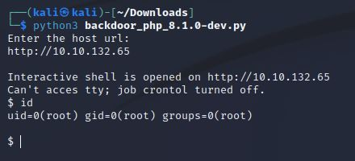
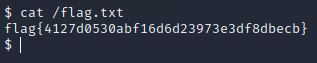

# Agent T VM
IP=10.10.132.65

## Rekonesans
Przeprowadzamy wstępny skan za pomocą narzędzia nmap:

```
sudo nmap -sV -sC 10.10.132.65
```

Otrzymujemy następujące wyniki:

```
Starting Nmap 7.92 ( https://nmap.org ) at 2024-07-04 12:17 EDT
Nmap scan report for 10.10.132.65
Host is up (0.053s latency).
Not shown: 999 closed tcp ports (reset)
PORT   STATE SERVICE VERSION
80/tcp open  http    PHP cli server 5.5 or later (PHP 8.1.0-dev)
|_http-title:  Admin Dashboard

Service detection performed. Please report any incorrect results at https://nmap.org/submit/ .
Nmap done: 1 IP address (1 host up) scanned in 10.95 seconds
```

Został wykryty tylko jeden port.

## Skanowanie

### Port 80
Rozpoczynamy od sprawdzenia portu 80. Skan narzędzia nmap wykrył, że jest to wersja PHP 8.1.0-dev. Sprawdzamy czy ta wersja jest podatna:


## Eksploitacja

Widzimy, że ta wersja jest podatna. Pobieramy [exploit'a](https://github.com/flast101/php-8.1.0-dev-backdoor-rce/blob/main/backdoor_php_8.1.0-dev.py) i wykorzystujemy go do uzyskania backdoor'a. Odpalamy skrypt podając adres url maszyny atakowanej:



W pliku flag.txt znajdujemy flagę:



```
flag{4127d0530abf16d6d23973e3df8dbecb}
```

Do zobaczenia na kolejnych CTF-ach!

