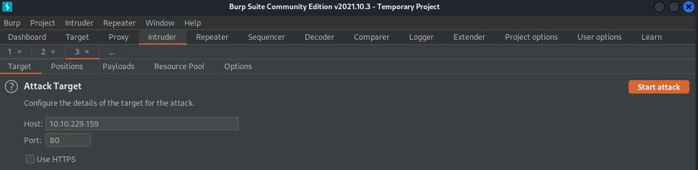
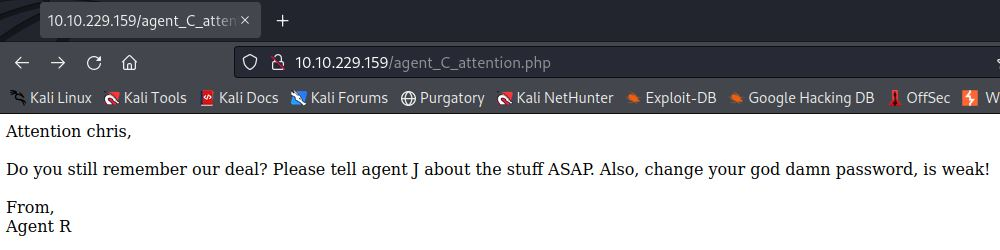
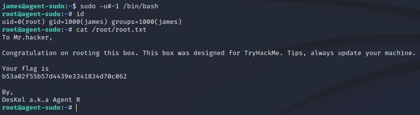

# Agent-sudo
IP=10.10.229.159

## Rekonesans
Przeprowadzamy wstępny skan za pomocą narzędzia nmap:

```
sudo nmap -sV -sC 10.10.229.159
```

Otrzymujemy następujące wyniki:

```
Starting Nmap 7.92 ( https://nmap.org ) at 2024-07-30 04:10 EDT
Nmap scan report for 10.10.229.159
Host is up (0.082s latency).
Not shown: 997 closed tcp ports (reset)
PORT   STATE SERVICE VERSION
21/tcp open  ftp     vsftpd 3.0.3
22/tcp open  ssh     OpenSSH 7.6p1 Ubuntu 4ubuntu0.3 (Ubuntu Linux; protocol 2.0)
| ssh-hostkey: 
|   2048 ef:1f:5d:04:d4:77:95:06:60:72:ec:f0:58:f2:cc:07 (RSA)
|   256 5e:02:d1:9a:c4:e7:43:06:62:c1:9e:25:84:8a:e7:ea (ECDSA)
|_  256 2d:00:5c:b9:fd:a8:c8:d8:80:e3:92:4f:8b:4f:18:e2 (ED25519)
80/tcp open  http    Apache httpd 2.4.29 ((Ubuntu))
|_http-title: Annoucement
|_http-server-header: Apache/2.4.29 (Ubuntu)
Service Info: OSs: Unix, Linux; CPE: cpe:/o:linux:linux_kernel

Service detection performed. Please report any incorrect results at https://nmap.org/submit/ .
Nmap done: 1 IP address (1 host up) scanned in 16.28 seconds
```

Zostały wykryte 3 porty.

## Skanowanie

### Port 80
Rozpoczynamy od sprawdzenia portu 80:


Na stronie widzimy notkę od Agenta R, że agenci powinni używać swoich kryptonimów zamiast user-agent, aby uzyskać dostęp do strony. Po nazwie Agenta R można się domyślić, że chodzi o litery alfabetu. Przechodzimy do analizy strony za pomocą narzędzia BurpSuite:


Następnie przesyłamy to żądanie do Intruder'a i przygotowujemy atak zmieniając pole user-agent na litery alfabetu:




Widzimy, że żądanie z literą "C" dało inną długość odpowiedzi oraz status 302, czyli strona została znaleziona. Przechodzimy zatem do Intercept'a, zmieniamy wartość pola User-Agent na literę "C" i przesyłamy zmodyfikowane żądanie:


W odpowiedzi uzyskujemy dostęp do ukrytej strony:



Dowiadujemy się, że użytkownik chris ma słabe hasło. Możemy to wykorzystać przeprowadzając atak brute-force na serwisy takie jak SSH lub FTP:

```
hydra -l chris -P /usr/share/wordlists/rockyou.txt ssh://10.10.229.159
```
```
hydra -l chris -P /usr/share/wordlists/rockyou.txt ftp://10.10.229.159
```

Po chwili udaje się złamać hasło do serwisu FTP:


### Port 21

Logujemy się do serwisu FTP i pobieramy wszystkie pliki:

```
chris:crystal
```


Z wiadomości dowiadujemy się, że w zdjęciach ukryte jest hasło:


Przechodzimy do steganografii. Za pomocą narzędzia "binwalk" otrzymujemy informację, w którym zdjęciu ukryte są pliki:


Wydobywamy ukryte pliki:


Korzystając z narzędzia JohnTheRipper łamiemy hasło:


```
alien
```

Teraz za pomocą poniższej komendy możemy rozszyfrować plik zip:

```
7z e 8702.zip
```

Odczytujemy ukrytą wiadomość:


Dekodujemy nazwę za pomocą CyberChef'a:


```
Area51
```

Znając hasło używamy narzędzia steghide do ekstrakcji ukrytych informacji:


Dostajemy login i hasło:

```
james:hackerrules!
```

### Port 22

Logujemy się do systemu komendą:

```
ssh james@10.10.229.159
```

W pliku user_flag.txt znajdujemy pierwszą flagę:


```
b03d975e8c92a7c04146cfa7a5a313c7
```

Pobieramy zdjęcie znalezione w katalogu domowym:

```
scp james@10.10.229.159:Alien_autospy.jpg /home/kali
```

Znajdujemy to zdjęcie w internecie na stronie [foxnews](https://www.foxnews.com/science/filmmaker-reveals-how-he-faked-infamous-roswell-alien-autopsy-footage-in-a-london-apartment?fbclid=IwAR0Qze0QmMWd0STeGhIOkXO_Gv-dgFxDn3fBwa5JYqGMglG0pDW0Zu5DxkA) pod nazwą "Roswell alien autopsy":


## Zwiększenie poziomu uprawnień

Sprawdzamy uprawnienia użytkownika james w systemie:


Użutkownik james nie jest w stanie wykonać komendy "bash". Sprawdzamy czy instnieją jakieś podatności:


Wykorzystując [exploita](https://www.exploit-db.com/exploits/47502) możemy uzyskać uprawnienia root'a:


W pliku root.txt znajdujemy drugą flagę:



```
b53a02f55b57d4439e3341834d70c062
```

Do zobaczenia na kolejnych CTF-ach!


