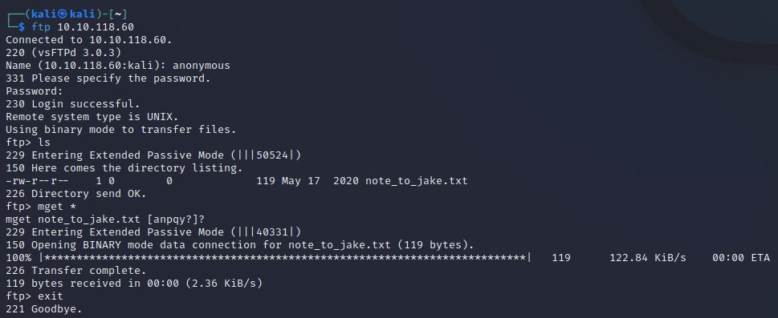

# Brooklyn99 CTF
IP=10.10.118.60

## Rekonesans
Przeprowadzamy wstępny skan za pomocą narzędzia nmap:

```
sudo nmap -sV -sC 10.10.118.60
```

Otrzymujemy następujące wyniki:

```
Starting Nmap 7.92 ( https://nmap.org ) at 2024-07-13 05:54 EDT
Nmap scan report for 10.10.118.60
Host is up (0.075s latency).
Not shown: 997 closed tcp ports (reset)
PORT   STATE SERVICE VERSION
21/tcp open  ftp     vsftpd 3.0.3
| ftp-syst: 
|   STAT: 
| FTP server status:
|      Connected to ::ffff:10.9.231.66
|      Logged in as ftp
|      TYPE: ASCII
|      No session bandwidth limit
|      Session timeout in seconds is 300
|      Control connection is plain text
|      Data connections will be plain text
|      At session startup, client count was 2
|      vsFTPd 3.0.3 - secure, fast, stable
|_End of status
| ftp-anon: Anonymous FTP login allowed (FTP code 230)
|_-rw-r--r--    1 0        0             119 May 17  2020 note_to_jake.txt
22/tcp open  ssh     OpenSSH 7.6p1 Ubuntu 4ubuntu0.3 (Ubuntu Linux; protocol 2.0)
| ssh-hostkey: 
|   2048 16:7f:2f:fe:0f:ba:98:77:7d:6d:3e:b6:25:72:c6:a3 (RSA)
|   256 2e:3b:61:59:4b:c4:29:b5:e8:58:39:6f:6f:e9:9b:ee (ECDSA)
|_  256 ab:16:2e:79:20:3c:9b:0a:01:9c:8c:44:26:01:58:04 (ED25519)
80/tcp open  http    Apache httpd 2.4.29 ((Ubuntu))
|_http-server-header: Apache/2.4.29 (Ubuntu)
|_http-title: Site doesn't have a title (text/html).
Service Info: OSs: Unix, Linux; CPE: cpe:/o:linux:linux_kernel

Service detection performed. Please report any incorrect results at https://nmap.org/submit/ .
Nmap done: 1 IP address (1 host up) scanned in 13.80 seconds
```

Zostały wykryte trzy porty, port 21 i port 80 są najciekawsze ze względu na potencjalne zagrożenia bezpieczeństwa.

## Skanowanie

### Port 21
Rozpoczynamy od sprawdzenia portu 21. Ze skanu wynika, ze logowanie Anonymous jest dozwolone. Logujemy się do serwisu i pobieramy znalezioną tam notatkę:

```
ftp 10.10.118.60
```

```
anonymous:anonymous
```



Z notatki wynika, że hasło użytkownika jake jest słabe. Spróbujmy to wykorzystać: 


