# Crack the hash

## Level 1

### Hash 1

Łamiemy hash za pomocą strony [CrackStation](https://crackstation.net/):

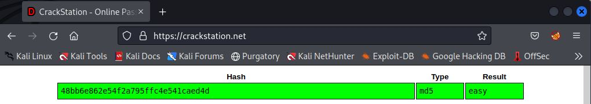

```
48bb6e862e54f2a795ffc4e541caed4d  |  easy
```

### Hash 2

Łamiemy hash za pomocą strony [CrackStation](https://crackstation.net/):

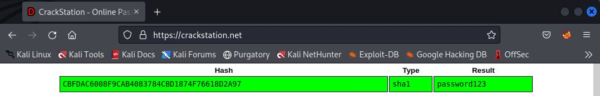

```
CBFDAC6008F9CAB4083784CBD1874F76618D2A97  |  password123
```

### Hash 3

Łamiemy hash za pomocą strony [CrackStation](https://crackstation.net/):

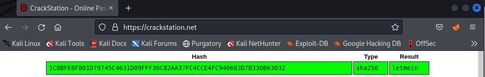

```
1C8BFE8F801D79745C4631D09FFF36C82AA37FC4CCE4FC946683D7B336B63032  |  letmein
```

### Hash 4

Strona CrackStation nie rozpoznała tego hasha. W związku z tym, że ten typ hasha łamie się bardzo długo za pomocą popularnej listy haseł "rockyou", tworzymy listę wszystkich możliwych haseł 4-literowych. Następnie łamiemy hash za pomocą narzędzia hashcat:

```
import itertools

characters = 'abcdefghijklmnopqrstuvwxyz'

passwords = [''.join(p) for p in itertools.product(characters, repeat=4)]

for password in passwords:
    print(password)

with open('passwords.txt', 'w') as f:
    for password in passwords:
        f.write(password + '\n')
```

Tworzymy skrypt, nadajemy mu uprawnienia do wykonywania oraz odpalamy go:

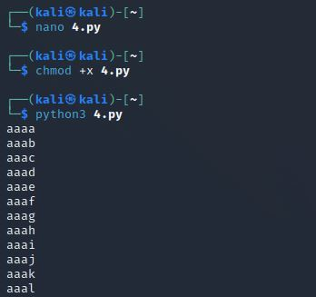

Wszystkie hasła zostały zapisane do pliku "passwords.txt". Odpalamy program hashcat i łamiemy hash:

```
hashcat -m 3200 -a 0 hash.txt /home/kali/passwords.txt
```

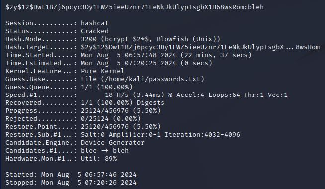

Hash ten można też złamać za pomocą innej [strony](https://hashes.com/en/decrypt/hash):

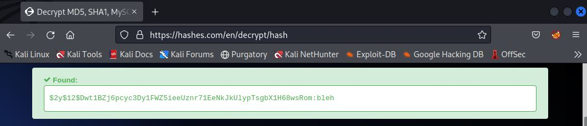

### Hash 5

Łamiemy hash za pomocą strony [CrackStation](https://crackstation.net/):

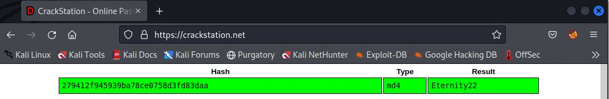

## Level 2

### Hash 1

Łamiemy hash za pomocą strony [CrackStation](https://crackstation.net/):

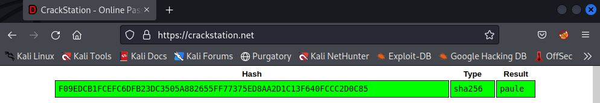

### Hash 2

Łamiemy hash za pomocą strony [CrackStation](https://crackstation.net/):

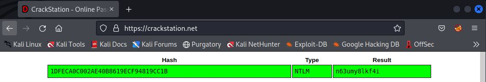

### Hash 3

Strona CrackStation nie rozpoznała tego hasha. Na stronie [hashcat'a](https://hashcat.net/wiki/doku.php?id=example_hashes) widzimy, że typ hasha to najprawdopodobniej SHA512 i mode powinien być ustawiony na 1800. Odpalamy hashcat'a:

```
hashcat -m 1800 -a 0 hash.txt /usr/share/wordlists/rockyou.txt
```

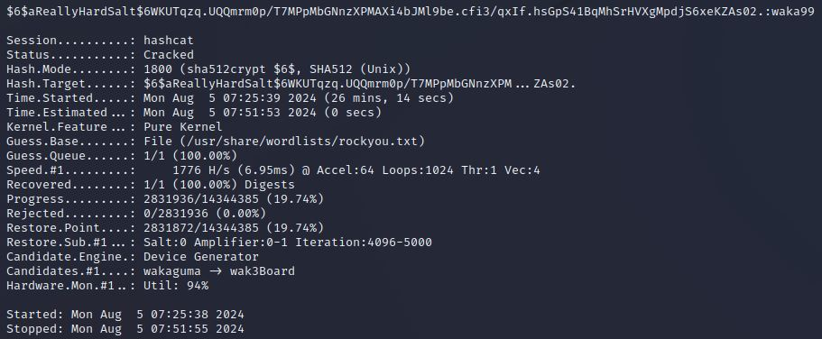

Hash ten można też złamać za pomocą [strony](https://hashes.com/en/decrypt/hash):

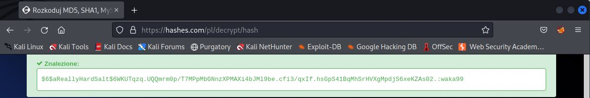

### Hash 4

Strona CrackStation nie rozpoznała tego hasha. Na stronie [hashcat'a](https://hashcat.net/wiki/doku.php?id=example_hashes) widzimy, że typ hasha to najprawdopodobniej HMAC-SHA1 i mode powinien być ustawiony na 160. Odpalamy hashcat'a:

```
hashcat -m 160 -a 0 hash.txt /usr/share/wordlists/rockyou.txt
```

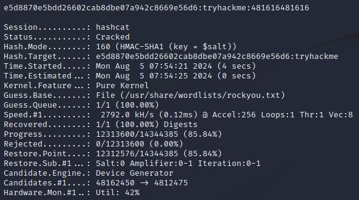

Hash ten można też złamać za pomocą [strony](https://hashes.com/en/decrypt/hash):

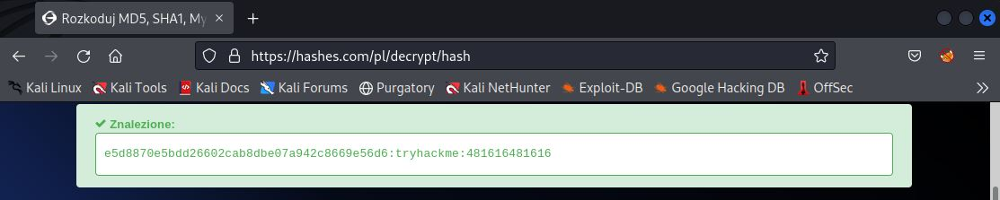

Do zobaczenia na kolejnych CTF-ach!
