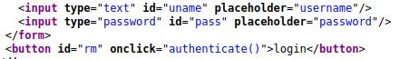

# Cyber Heroes
IP=10.10.105.69

## Rekonesans
Przeprowadzamy wstępny skan za pomocą narzędzia nmap:

```
sudo nmap -p- 10.10.105.69
```

Otrzymujemy następujące wyniki:

```
Starting Nmap 7.92 ( https://nmap.org ) at 2024-07-06 03:39 EDT
Nmap scan report for 10.10.105.69
Host is up (0.048s latency).
Not shown: 65533 closed tcp ports (reset)
PORT   STATE SERVICE
22/tcp open  ssh
80/tcp open  http

Nmap done: 1 IP address (1 host up) scanned in 270.67 seconds
```

Zostały wykryte tylko dwa porty.

## Skanowanie

### Port 80
Rozpoczynamy od sprawdzenia portu 80:


Widzimy stronę internetową zawierającą panel logowania. Przechodzimy do niego:


Aby zdobyć flagę musimy się zalogować. Próbujemy się zalogować, ale zostało podane złe hasło:


Przechodzimy do źródła strony. Widzimy, że za logowanie odpowiada funkcja "authenticate()":



Dokonujemy analizy skryptu:


Aby otrzymać flagę należy podać poprawną nazwę użytkownika i hasło:

```
if (a.value=="h3ck3rBoi" & b.value==RevereString("54321@terceSrepuS")) {
```

Nazwa użytkownika to "h3ck3rBoi", a hasło zostało odwrócone przez funkcję "RevereString", zatem dane do logowania to:

```
h3ck3rBoi:SuperSecret@12345
```

Po zalogowaniu zdobywamy flagę:


```
flag{edb0be532c540b1a150c3a7e85d2466e}
```

Do zobaczenia na kolejnych CTF-ach!


