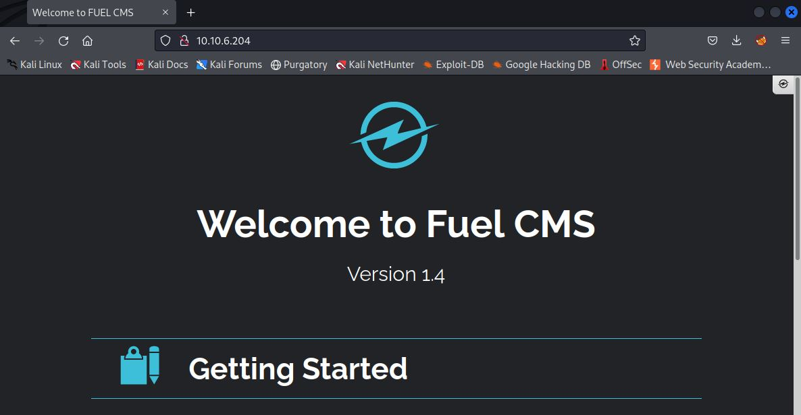
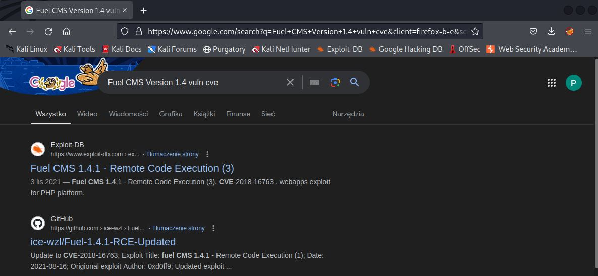
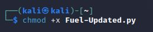
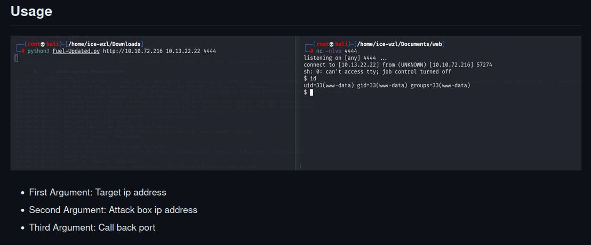
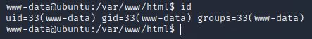
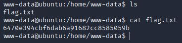
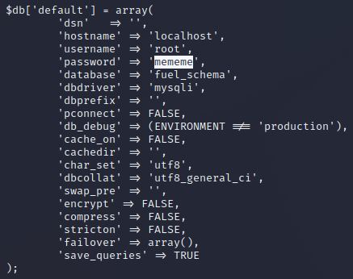
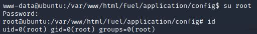
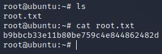

# Ignite VM
IP=10.10.6.204

## Rekonesans
Przeprowadzamy wstępny skan za pomocą narzędzia nmap:

```
sudo nmap -sV -sC 10.10.6.204
```

Otrzymujemy następujące wyniki:

```
Starting Nmap 7.92 ( https://nmap.org ) at 2024-08-06 12:18 EDT
Nmap scan report for 10.10.6.204
Host is up (0.075s latency).
Not shown: 999 closed tcp ports (reset)
PORT   STATE SERVICE VERSION
80/tcp open  http    Apache httpd 2.4.18 ((Ubuntu))
|_http-title: Welcome to FUEL CMS
| http-robots.txt: 1 disallowed entry 
|_/fuel/
|_http-server-header: Apache/2.4.18 (Ubuntu)

Service detection performed. Please report any incorrect results at https://nmap.org/submit/ .
Nmap done: 1 IP address (1 host up) scanned in 16.15 seconds
```

Został wykryty tylko jeden port.

## Skanowanie

### Port 80
Rozpoczynamy od sprawdzenia portu 80:



Widzimy, że jest to aplikacja Fuel CMS w wersji 1.4. Szukamy podatności na tą wersję aplikacji:



## Eksploitacja

Aplikacja jest podatna na zdalne wykonanie kodu - RCE (Remote Code Execution). Pobieramy [exploit'a](https://github.com/ice-wzl/Fuel-1.4.1-RCE-Updated/blob/main/Fuel-Updated.py), nadajemy mu uprawnienia do wykonania i odpalamy z odpowiednimi argumentami:




Zdobyliśmy dostęp maszyny:



W katalogu domowym użytkownika www-data znajdujemy pierwszą flagę:



```
6470e394cbf6dab6a91682cc8585059b 
```

## Zwiększenie poziomu uprawnień

W pliku /var/www/html/fuel/application/config/database.php znajdujemy hasło użytkownika root:



Logujemy się na konto użytkownika root za pomocą komendy su:



W katalogu domowym użytkownika root znajdujemy drugą flagę:



```
b9bbcb33e11b80be759c4e844862482d
```

Do zobaczenia na kolejnych CTF-ach!
