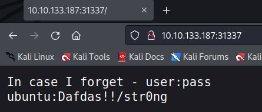
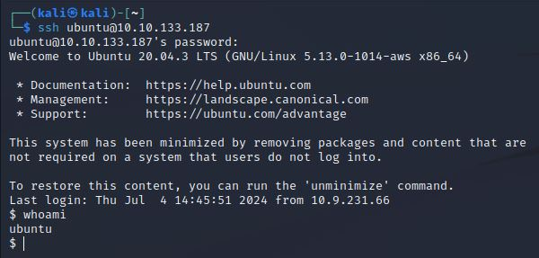
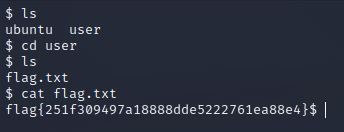

# Intermediate Nmap
IP=10.10.133.187

## Rekonesans
Przeprowadzamy wstępny skan za pomocą narzędzia nmap:

```
sudo nmap -p- 10.10.133.187
```

Otrzymujemy następujące wyniki:

```
┌──(kali㉿kali)-[~]
└─$ sudo nmap -p- 10.10.133.187
[sudo] password for kali: 
Starting Nmap 7.92 ( https://nmap.org ) at 2024-07-04 11:10 EDT
Nmap scan report for 10.10.133.187
Host is up (0.054s latency).
Not shown: 65532 closed tcp ports (reset)
PORT      STATE SERVICE
22/tcp    open  ssh
2222/tcp  open  EtherNetIP-1
31337/tcp open  Elite

Nmap done: 1 IP address (1 host up) scanned in 43.17 seconds
```

Port 31337 jest portem bardzo wysokim, a co za tym idzie - ciekawym, dlatego to od niego zaczniemy.

## Skanowanie

### Port 31337

Rozpoczynamy od sprawdzenia portu 31337:



```
ubuntu:Dafdas!!/str0ng
```

### Port 22

Znajdujemy notatkę z nazwą użytkownika i hasłem. Dane te wykorzystujemy do logowania za pomocą SSH:

```
ssh ubuntu@10.10.133.187
```



## Eksploitacja

W katalogu domowym użytkownika user znajdujemy flagę:



```
flag{251f309497a18888dde5222761ea88e4}
```

Do zobaczenia na kolejnych CTF-ach!
