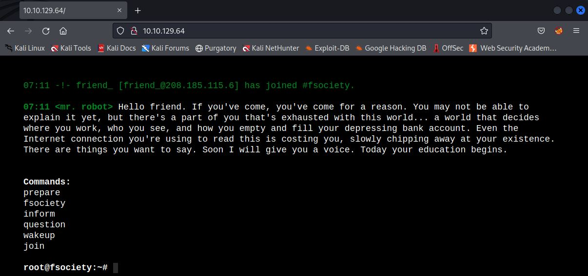
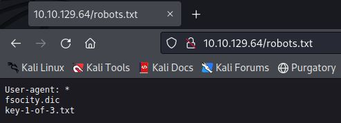
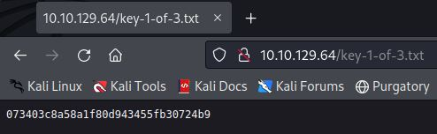

# Mr Robot
IP=10.10.22.73

## Rekonesans
Przeprowadzamy wstępny skan za pomocą narzędzia nmap:

```
sudo nmap -sV -sC 10.10.22.73 
```

Otrzymujemy następujące wyniki:

```
Starting Nmap 7.92 ( https://nmap.org ) at 2024-08-03 14:04 EDT
Nmap scan report for 10.10.22.73
Host is up (0.049s latency).
Not shown: 997 filtered tcp ports (no-response)
PORT    STATE  SERVICE  VERSION
22/tcp  closed ssh
80/tcp  open   http     Apache httpd
|_http-title: Site doesn't have a title (text/html).
|_http-server-header: Apache
443/tcp open   ssl/http Apache httpd
|_http-server-header: Apache
|_http-title: Site doesn't have a title (text/html).
| ssl-cert: Subject: commonName=www.example.com
| Not valid before: 2015-09-16T10:45:03
|_Not valid after:  2025-09-13T10:45:03

Service detection performed. Please report any incorrect results at https://nmap.org/submit/ .
Nmap done: 1 IP address (1 host up) scanned in 20.78 seconds
```

Zostały wykryte 3 porty.

## Skanowanie

### Port 80
Rozpoczynamy od sprawdzenia portu 80:



Strona nie zawiera nic ciekawego, przechodzimy do enumeracji katalogów:

ffffufff

W katalogu robots.txt znajdujemy lokalizację pierwszej flagi oraz plik, który po pobraniu okazuje się być listą słów:



Odczytujemy pierwszą flagę:



```
073403c8a58a1f80d943455fb30724b9
```

