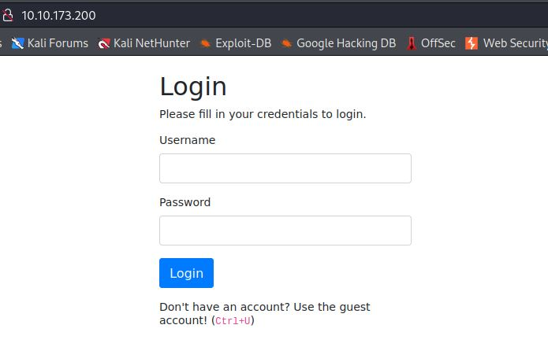
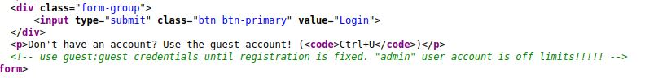
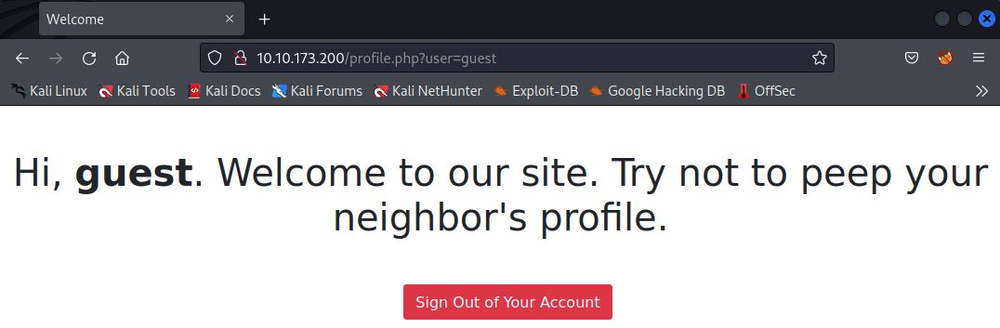
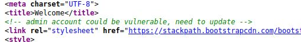
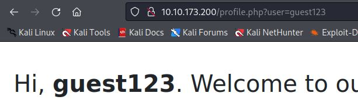
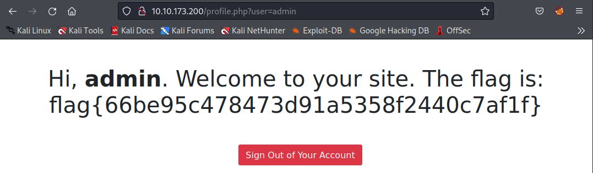

# Neighbour-newapp
IP=10.10.173.200

## Rekonesans
Przeprowadzamy wstępny skan za pomocą narzędzia nmap:

```
sudo nmap -sV -sC 10.10.173.200
```

Otrzymujemy następujące wyniki:

```
Starting Nmap 7.92 ( https://nmap.org ) at 2024-07-01 10:16 EDT
Nmap scan report for 10.10.173.200
Host is up (0.063s latency).
Not shown: 998 closed tcp ports (reset)
PORT   STATE SERVICE VERSION
22/tcp open  ssh     OpenSSH 8.2p1 Ubuntu 4ubuntu0.5 (Ubuntu Linux; protocol 2.0)
| ssh-hostkey: 
|   3072 80:df:8e:fa:ce:a1:8c:04:3c:73:63:42:2e:e1:88:db (RSA)
|   256 87:f9:0a:9a:56:a0:e8:0b:83:0c:98:f3:84:18:79:c8 (ECDSA)
|_  256 40:9a:0b:4f:16:70:7c:a4:0a:89:8d:7d:57:d1:c2:bf (ED25519)
80/tcp open  http    Apache httpd 2.4.53 ((Debian))
| http-cookie-flags: 
|   /: 
|     PHPSESSID: 
|_      httponly flag not set
|_http-server-header: Apache/2.4.53 (Debian)
|_http-title: Login
Service Info: OS: Linux; CPE: cpe:/o:linux:linux_kernel

Service detection performed. Please report any incorrect results at https://nmap.org/submit/ .
Nmap done: 1 IP address (1 host up) scanned in 10.09 seconds
```

Sprawdzamy wszystkie porty komendą:

```
sudo nmap -p- 10.10.173.200
```

Otrzymujemy następujące wyniki:

```
Starting Nmap 7.92 ( https://nmap.org ) at 2024-07-01 10:16 EDT
Nmap scan report for 10.10.173.200
Host is up (0.094s latency).
Not shown: 65533 closed tcp ports (reset)
PORT   STATE SERVICE
22/tcp open  ssh
80/tcp open  http

Nmap done: 1 IP address (1 host up) scanned in 61.50 seconds
```

Port 80 jest najciekawszy ze względu na potencjalne zagrożenia bezpieczeństwa.

## Skanowanie

### Port 80
Rozpoczynamy od sprawdzenia portu 80:



Widzimy panel logowania. Zgodnie z podpowiedzią przechodzimy do źródła strony, aby stworzyć konto gościa (Ctrl+U):



```
<!-- use guest:guest credentials until registration is fixed. "admin" user account is off limits!!!!! -->
```

Logujemy się do systemu za pomocą znalezionych danych do logowania:

```
guest:guest
```



W źródle strony znajdujemy komenatrz, że konto administartora może mieć podatność:



```
<!-- admin account could be vulnerable, need to update -->
```

Testujemy, czy można uzyskać dostęp do innych profili poprzez manipulację parametrem "user" w URL:



Widzimy, że zmiana parametru "user" w URL pozwala na dostęp do innych kont. Możemy wykorzystać tą podatność (Insecure Direct Object Reference - IDOR) zmieniając wartość parametru "user" na "admin", aby zalogować się na konto administratora:



Na ekranie została wyświetlona flaga.

```
flag{66be95c478473d91a5358f2440c7af1f}
```

Do zobaczenia na kolejnych CTF-ach!


