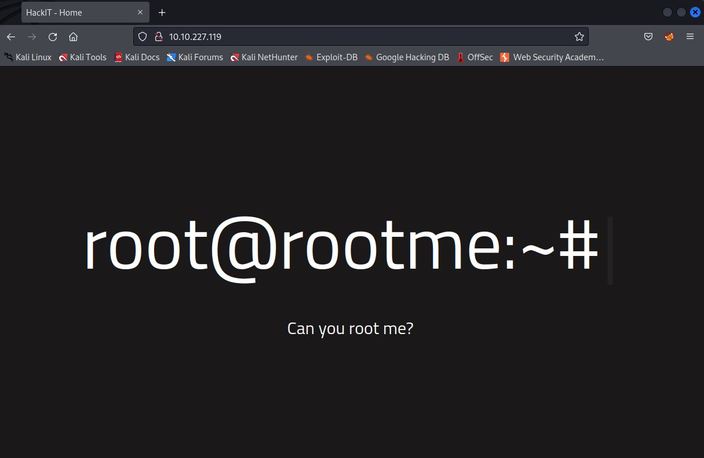
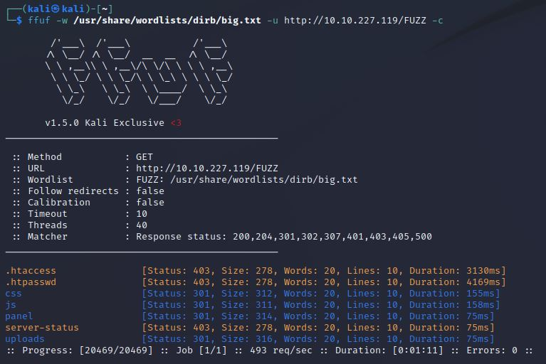
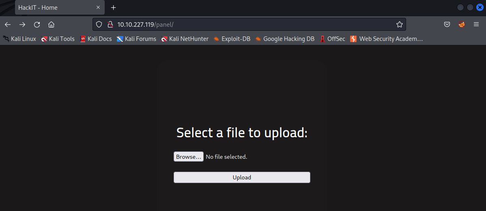
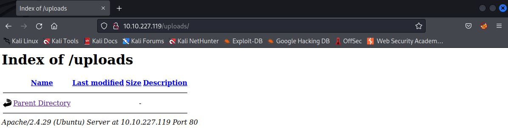
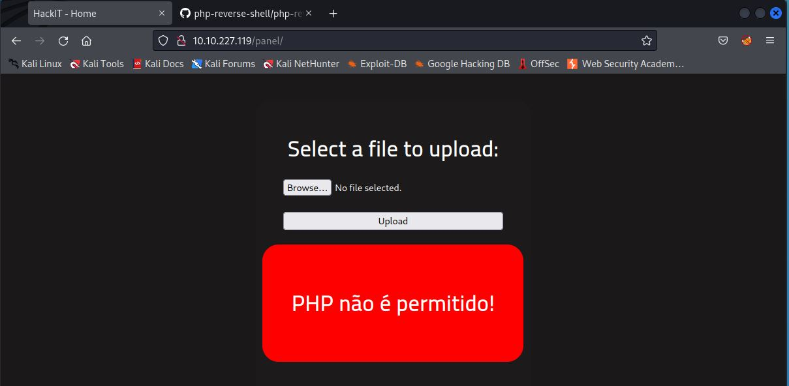
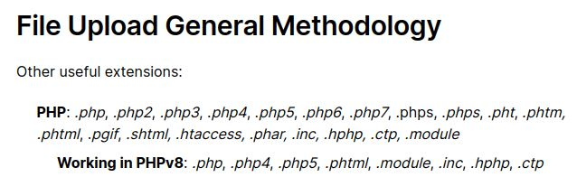
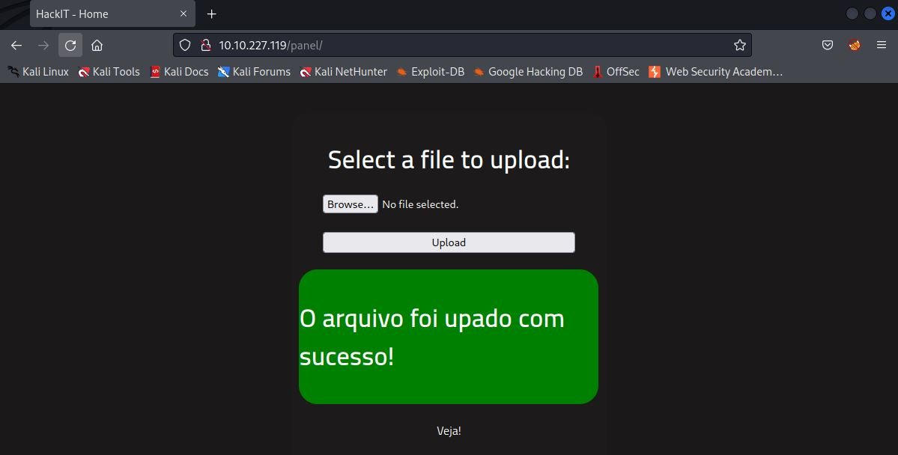
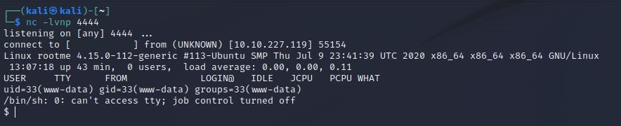

# RootMe
IP=10.10.227.119

## Rekonesans
Przeprowadzamy wstępny skan za pomocą narzędzia nmap:

```
sudo nmap -sV -sC 10.10.227.119  
```

Otrzymujemy następujące wyniki:

```
Starting Nmap 7.92 ( https://nmap.org ) at 2024-07-09 08:26 EDT
Nmap scan report for 10.10.227.119
Host is up (0.12s latency).
Not shown: 998 closed tcp ports (reset)
PORT   STATE SERVICE VERSION
22/tcp open  ssh     OpenSSH 7.6p1 Ubuntu 4ubuntu0.3 (Ubuntu Linux; protocol 2.0)
| ssh-hostkey: 
|   2048 4a:b9:16:08:84:c2:54:48:ba:5c:fd:3f:22:5f:22:14 (RSA)
|   256 a9:a6:86:e8:ec:96:c3:f0:03:cd:16:d5:49:73:d0:82 (ECDSA)
|_  256 22:f6:b5:a6:54:d9:78:7c:26:03:5a:95:f3:f9:df:cd (ED25519)
80/tcp open  http    Apache httpd 2.4.29 ((Ubuntu))
|_http-server-header: Apache/2.4.29 (Ubuntu)
| http-cookie-flags: 
|   /: 
|     PHPSESSID: 
|_      httponly flag not set
|_http-title: HackIT - Home
Service Info: OS: Linux; CPE: cpe:/o:linux:linux_kernel

Service detection performed. Please report any incorrect results at https://nmap.org/submit/ .
Nmap done: 1 IP address (1 host up) scanned in 15.62 seconds
```

Wykryte zostały dwa porty: 22 (SSH) i 80 (HTTP). Wersja Apache to 2.4.29. Na porcie 22 działa usługa SSH.

## Skanowanie

### Port 80
Rozpoczynamy od sprawdzenia portu 80:



Jest to strona startowa. Przechodzimy do enumeracji katalogów za pomocą narzędzia ffuf:

```
ffuf -w /usr/share/wordlists/dirb/big.txt -u http://10.10.227.119/FUZZ -c 
```



Znajdujemy dwie ciekawe lokalizacje: /panel i /uploads:





Pobieramy [skrypt](https://github.com/pentestmonkey/php-reverse-shell/blob/master/php-reverse-shell.php) reverse-shell'a i próbujemy go wgrać:



Okazuje się, że pliki z rozszerzeniem .php są zakazane. Spróbujmy obejść to zabezpieczenie stosując [inne](https://book.hacktricks.xyz/pentesting-web/file-upload) rozszerzenie:



Zmieniamy rozszerzenie skryptu na np. .php5 i ponownie wgrywamy:



Widzimy, że skrypt został wgrany pomyślnie. Po ustawieniu nasłuchiwania przechodzimy do podstrony /uploads i klikamy na wgrany skrypt:

```
nc -lvnp 4444
```




Otrzymujemy dostęp do serwera przez reverse-shell'a


