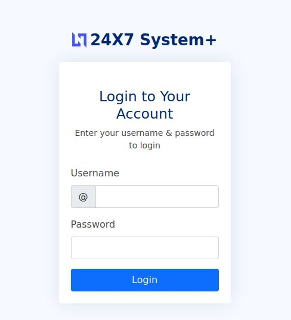

# Surfer
IP=10.10.87.58

## Rekonesans
Przeprowadzamy wstępny skan za pomocą narzędzia nmap:

```
sudo nmap -sV -sC 10.10.173.200
```

Otrzymujemy następujące wyniki:

```
Starting Nmap 7.92 ( https://nmap.org ) at 2024-07-04 04:49 EDT
Nmap scan report for 10.10.87.58
Host is up (0.058s latency).
Not shown: 998 closed tcp ports (reset)
PORT   STATE SERVICE VERSION
22/tcp open  ssh     OpenSSH 8.2p1 Ubuntu 4ubuntu0.4 (Ubuntu Linux; protocol 2.0)
| ssh-hostkey: 
|   3072 2f:66:ac:d7:0d:69:04:df:90:f9:e5:32:22:13:62:4c (RSA)
|   256 c3:f2:8b:12:a7:45:93:2e:59:85:d8:66:fd:0d:48:85 (ECDSA)
|_  256 20:ea:b3:80:24:7d:75:9e:b6:0a:b9:54:32:85:10:13 (ED25519)
80/tcp open  http    Apache httpd 2.4.38 ((Debian))
| http-title: 24X7 System+
|_Requested resource was /login.php
| http-robots.txt: 1 disallowed entry 
|_/backup/chat.txt
| http-cookie-flags: 
|   /: 
|     PHPSESSID: 
|_      httponly flag not set
|_http-server-header: Apache/2.4.38 (Debian)
Service Info: OS: Linux; CPE: cpe:/o:linux:linux_kernel

Service detection performed. Please report any incorrect results at https://nmap.org/submit/ .
Nmap done: 1 IP address (1 host up) scanned in 9.65 seconds
```

Port 80 jest najciekawszy ze względu na potencjalne zagrożenia bezpieczeństwa.

## Skanowanie

### Port 80
Rozpoczynamy od sprawdzenia portu 80:



Widzimy, że jest to panel logowania na podstronie /login.php. Skan narzędzia nmap wykrył jeszcze jedną podstronę: /backup/chat.txt:


Dowiadujemy się, że użytkownik Admin używa swojej nazwy użytkownika jako hasła. Logujemy się do systemu:

```
admin:admin
```


Widzimy, że jest to strona finansowa. Znajdujemy na niej notkę o tym gdzie jest ukryta flaga:


Przechodząc na podstronę napotykamy na błąd:


## Eksploitacja

Aby dostać się na tą podstronę trzeba wykonać zapytanie lokalnie. Opcja tworzenia raportu spełnia wymagania:


Przy pomoc narzędzia BurpSuite przechwytujemy żądanie tworzenia raportu:


Udajemy się do Intercept'a i zmieniamy url żądania na podstronę /internal/admin.php:

```
url=http%3a%2f%2f127.0.0.1%2finternal%2fadmin.php
```


Po przekazaniu zmodyfikowanego żądania (Forward) otrzymujemy flagę:


```
flag{6255c55660e292cf0116c053c9937810}
```

Do zobaczenia na kolejnych CTF-ach!

